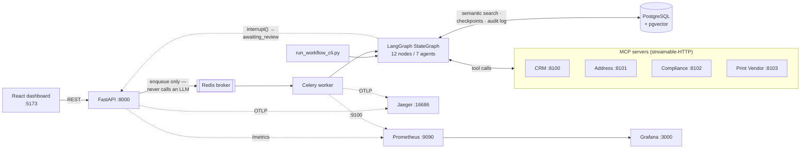

# PRF AI Pipeline

[](https://github.com/umeshkedimi/prf-ai-pipeline/actions/workflows/ci.yml)

A production-grade **agentic AI platform** for nonprofit fundraising campaigns. It takes donor records exported from a CRM and turns them into personalized, compliant, print-ready fundraising letters (PRFs) — automating donor validation, enrichment, personalization, and document generation through a multi-agent LangGraph workflow with human-in-the-loop review.

Built as a portfolio-quality reference architecture for Agentic AI / AI Platform Engineering roles: multi-agent orchestration, confidence-based routing, RAG, MCP tool integrations, checkpointing/resume, evaluation-driven development, and full explainability/auditability.

**In one sentence:** `POST /workflow/run {"donor_id": "d-0009"}` → seven agents verify the donor, repair a stale address, compute a defensible ask amount, draft a grounded letter, review it for legal risk, and hand a print-ready PDF to a mail vendor — pausing for a human whenever a deterministic rule says the decision is too consequential to automate.

---

## Contents

- [Business context](#business-context)
- [Architecture](#architecture)
- [Repository layout](#repository-layout)
- [Status](#status)
- [The pipeline graph](#the-pipeline-graph)
- [The agents](#the-agents)
- [Human review](#human-review)
- [Status and confidence semantics](#status-and-confidence-semantics)
- [Data model](#data-model)
- [API reference](#api-reference)
- [Configuration reference](#configuration-reference)
- [Getting started](#getting-started)
- [Frontend (review dashboard)](#frontend-review-dashboard)
- [Observability](#observability)
- [Demos](#demos)
- [The seed dataset](#the-seed-dataset)
- [Tests and CI](#tests-and-ci)
- [Evaluation framework](#evaluation-framework)
- [Design decisions and trade-offs](#design-decisions-and-trade-offs)
- [Known limitations](#known-limitations)

---

## Business context

Nonprofits (animal rescue orgs, food banks, disaster relief, community welfare NGOs) run fundraising campaigns by mailing physical donation-request letters to previous donors. Input is donor data exported from a CRM; output is a print-ready PDF mailed by a print vendor.

```json
{
  "donor_id": "12345",
  "name": "John Doe",
  "address": "123 Main Street, Dallas, TX",
  "last_donation_amount": 100,
  "last_donation_date": "2025-04-01",
  "campaign": "Animal Rescue Mission"
}
```

Doing this by hand is slow and error-prone in ways that carry real consequence: mailing someone who asked not to be contacted, mailing a deceased donor's household, asking a $25/year donor for $5,000, mailing into a state the org isn't registered to solicit in, or printing a letter that promises an outcome a single gift can't deliver. Each of those is a distinct failure mode, and each maps to an agent below.

## Architecture



Seven LangGraph agents, each producing a confidence-scored, explainable decision, with human review interrupts for low-confidence or high-stakes cases:

| # | Agent | Responsibility | LLM? |
|---|---|---|---|
| 1 | **Donor Verification** | Eligibility, duplicate detection, do-not-contact/suppression checks | Yes (+ tool loop) |
| 2 | **Address Intelligence** | Validation, move detection, normalization | Yes |
| 3 | **Donation Recommendation** | RFM scoring, ask-ladder generation | Yes (money math is not) |
| 4 | **Campaign Personalization** | RAG-backed personalized letter copy | Yes |
| 5 | **Compliance** | Disclaimers, tax language, state regulations | Yes (registration check is not) |
| 6 | **PDF Generation** | Print-ready PDF, barcodes, QR codes, mailing metadata | **No** — purely mechanical |
| 7 | **Human Review** | LangGraph `interrupt()`-based pause/approve/reject/modify/resume | No |

### The three architectural boundaries

These are the load-bearing decisions. Everything else follows from them.

**1. The determinism boundary.** Deterministic work (MCP calls, compliance flags, RFM scoring, ask-ladder arithmetic) is done in plain Python; only genuine judgment is delegated to the LLM. **Money amounts are computed, never generated.** Critically, every *blocking* human-review gate routes off a deterministic value — the ask amount, the state-registration flag — never off a model-produced confidence float. Routing a blocking pause off a non-deterministic float would let the same donor take different paths on identical data, which is unacceptable when the output is a physical letter.

**2. The data boundary.** Structured donor/CRM/donation data lives in PostgreSQL and is queried relationally. RAG (vector search) is used *only* for unstructured campaign knowledge — annual reports, impact stats, success stories, compliance guidelines. **Donor PII is never embedded.** Semantic similarity is the wrong retrieval mechanism for "what did this donor give last year," and embedding PII into a vector store creates an exfiltration surface with no upside.

**3. The execution boundary.** The API never invokes an LLM — it validates, persists, and enqueues, then returns `202`. All model work happens in the Celery worker. This keeps request latency bounded and independent of model latency (a full run is ~30s), and means a model outage degrades throughput rather than taking down the API.

**MCP servers.** CRM, Address, Compliance, and Print Vendor are each a *real* MCP protocol server (FastMCP, streamable-HTTP), backed by synthetic/mocked data. The protocol is genuine — agents reach external systems only through auditable, tool-mediated calls via `langchain-mcp-adapters`; only the data behind them is fake. Swapping a mock for a real vendor is a URL change, not a refactor.

**Stack:** FastAPI, LangGraph, PostgreSQL (+ pgvector), Redis, Celery, Docker, OpenTelemetry, Prometheus, Grafana, Jaeger, React.

## Repository layout

```
.
├── backend/
│   ├── src/app/
│   │   ├── agents/<name>/      agent.py (graph nodes) + prompts.py + schemas.py
│   │   │                       └── plus rules.py / rfm.py / render.py where the
│   │   │                           agent has deterministic logic to keep out of the LLM
│   │   ├── graph/              builder.py (StateGraph + routing), state.py,
│   │   │                       checkpointer.py, tracing.py
│   │   ├── mcp_servers/        real FastMCP streamable-HTTP servers
│   │   │                       (crm, address, compliance, print_vendor)
│   │   ├── mcp_clients/        MultiServerMCPClient wrappers + response parsing
│   │   ├── rag/                pgvector retrieval — embeddings, store, retriever
│   │   ├── evals/              harness (types, runner, scorers, report, store)
│   │   │                       + suites/ (8 suites)
│   │   ├── workers/            Celery app + tasks + Prometheus metrics
│   │   ├── api/v1/endpoints/   FastAPI routes (workflow, health)
│   │   ├── db/models/          SQLAlchemy models
│   │   ├── schemas/            Pydantic request/response schemas
│   │   └── core/               config, llm factory, audit, logging, telemetry
│   ├── knowledge/              markdown corpus ingested into pgvector (6 docs)
│   ├── alembic/versions/       6 migrations
│   ├── scripts/                seed_db, ingest_knowledge, run_evals, run_workflow_cli
│   ├── evals/results/          baseline.json (committed), latest.json (gitignored)
│   ├── storage/letters/        generated PDFs (gitignored)
│   └── tests/                  unit/ (offline, mocked) + integration/ (live stack)
├── frontend/                   Vite + React + TypeScript review dashboard
├── observability/              Prometheus config + Grafana provisioning/dashboard
├── .github/workflows/ci.yml    ruff check + offline unit suite
└── docker-compose.yml          11 services
```

Every agent directory follows the same shape, so a reviewer who reads one can navigate all seven. Where an agent has deterministic logic, it lives in its own module (`rfm.py`, `rules.py`, `render.py`) rather than inside `agent.py` — that separation is the determinism boundary made visible in the file tree.

## Status

Built **incrementally, phase by phase**, each phase fully working and demoable before the next begins.

| Phase | Scope |
|---|---|
| **1** ✅ | Repo foundations, DB schema, Donor Verification agent end-to-end (real Postgres, real CRM MCP server, real LLM call, LangGraph checkpointing, Celery + FastAPI wiring) |
| **2** ✅ | Address Intelligence agent + Address MCP + first real `interrupt()`-based Human Review node + confidence routing, chained after Donor Verification |
| **3** ✅ | Donation Recommendation agent (deterministic RFM + ask ladder) + pgvector RAG over campaign knowledge + a second review trigger on major-gift asks |
| **4** ✅ | Campaign Personalization agent (deterministic tone lookup + RAG-grounded letter draft), chained after Donation Recommendation |
| **5** ✅ | Compliance agent (deterministic state-registration/disclosure lookup + RAG-grounded letter-risk review) + Compliance MCP; a third review trigger on unregistered-state solicitation |
| **6** ✅ | PDF Generation agent (deterministic letter layout, QR code, Code128 barcode) + Print Vendor MCP — no LLM call, purely mechanical assembly and a mocked vendor order |
| **7** ✅ | Review queue (`GET /workflow/reviews` with donor/campaign names and pagination) + per-run decision history (`review_history`, derived from the audit trail) + routing a disapproved compliance review to `needs_review` + `graph/builder.py` split into named verification/fulfillment units |
| **8** ✅ | **8a** React review dashboard (`frontend/`). **8b** OpenTelemetry tracing + Prometheus metrics + Jaeger/Grafana (`observability/`) — one trace per run spanning API, Celery, and every agent node. **8c** CI (`.github/workflows/ci.yml`) — lint + offline unit suite on every push/PR |

**Evaluation framework** ✅ — built early, at three agents rather than seven, deliberately: evals written after the fact get written to pass, encoding existing behavior as correct. See [Evaluation framework](#evaluation-framework).

All eight phases plus the evaluation framework are complete.

## The pipeline graph

12 nodes across 7 agents. Every node is a real checkpoint boundary — the graph can crash and resume at any of them.

```
START → fetch_core_data → gather_context → synthesize_verdict
           │
           ├─ ineligible → END
           │
           └─ eligible → verify_address → assess_and_normalize
                            │
                            ├─ confidence < threshold → human_review [interrupt, stage=address]
                            ├─ deliverable → compute_rfm
                            └─ confident but undeliverable → END   (nothing to mail)
                                            │
        (address review resumes) ───────────┤
                            ├─ now deliverable → compute_rfm
                            └─ rejected → END
                                            │
                     compute_rfm → recommend_ask   [RAG over campaign knowledge]
                                       │
                                       ├─ ask ≥ major-gift threshold
                                       │      → human_review [interrupt, stage=recommendation]
                                       │            ├─ approved/modified, ask > 0 → personalize_letter
                                       │            └─ rejected (ask zeroed) → END
                                       └─ else → personalize_letter   [RAG over campaign knowledge]
                                                       │
                                     personalize_letter → gather_disclosures
                                                       │
                                                       ├─ not registered to solicit in-state
                                                       │      → human_review [interrupt, stage=compliance]
                                                       │            ├─ approve/modify → review_letter_compliance
                                                       │            └─ reject → END
                                                       └─ registered → review_letter_compliance
                                                                          [RAG over compliance guidance]
                                                                          │
                                                                          └─ generate_pdf → END
                                                                                [Print Vendor MCP]
```

In `graph/builder.py` these are assembled as two named units onto one flat `StateGraph` — a **verification unit** (`fetch_core_data` → `gather_context` → `synthesize_verdict` → `verify_address` → `assess_and_normalize`) and a **fulfillment unit** (`compute_rfm` → `recommend_ask` → `personalize_letter` → `gather_disclosures` → `review_letter_compliance` → `generate_pdf`), wired through the shared `human_review` gate.

This is deliberately a *code-organization* split, not LangGraph nested subgraphs. Nested subgraphs can only be entered at their own `START`, but `route_after_human_review` resumes **mid-unit** — into `compute_rfm`, `personalize_letter`, or `review_letter_compliance` depending on which stage paused. Nested subgraphs cannot express that, so using them would have meant contorting resume semantics to fit a diagram. A supervisor/dynamic-routing rewrite was also considered and rejected: it would spread runtime-decided routing across the whole pipeline shape, cutting directly against the determinism boundary.

## The agents

**Donor Verification** (Phase 1) — 3 nodes:

1. **`fetch_core_data`** — deterministic `get_donor_profile` MCP call. `do_not_contact`/suppression flags are read as-is, never inferred by the LLM.
2. **`gather_context`** — an LLM bound to `get_donation_history` + `find_potential_duplicate_donors` (via `langchain-mcp-adapters`, a real streamable-HTTP MCP server), in a bounded tool-calling loop.
3. **`synthesize_verdict`** — structured-output LLM call (`eligible`, `confidence`, `reason`, `is_duplicate`, `is_suspicious`, `reasoning[]`). Compliance rules (do-not-contact, suppression) are enforced by explicit instruction, never left to model judgment. "Eligible" is scoped strictly to compliance/legitimacy — the model is explicitly told *not* to factor in address deliverability, which is a separate downstream concern.

**Address Intelligence** (Phase 2) — 2 nodes, only reached if the donor is eligible:

1. **`verify_address`** — deterministic `verify_address` MCP call. Donors with no address on file skip the call entirely.
2. **`assess_and_normalize`** — deterministically calls `lookup_new_address` when `verify_address` flagged `moved=true` (that lookup is a business rule, not a judgment call), then an LLM produces the final structured `AddressResult` (`deliverable`, `confidence`, `updated_address`, `moved`, `reasoning[]`).

**Donation Recommendation** (Phase 3) — 2 nodes, only reached for a donor we can actually mail:

1. **`compute_rfm`** — fully deterministic. Recency/Frequency/Monetary scoring and the 3-rung ask ladder (typical → step-up → aspirational) are computed by formula from giving history, with no LLM involved. Reuses the `donation_history` `gather_context` already fetched rather than re-hitting the CRM.
2. **`recommend_ask`** — retrieves campaign knowledge from pgvector, then an LLM *chooses* a rung from that ladder and justifies it. It is explicitly forbidden from inventing or altering dollar figures — the money math is reproducible and auditable; only the judgment is model-driven.

The ladder is **outlier-robust**: if the top gift dwarfs the rest of the history (>5× the median), it's treated as a likely data-entry error or one-off windfall and the anchor falls back to the median, recorded as `outlier_gift_excluded`. Without this, d-0006's anomalous $50,000 donation — the very record Donor Verification flags as suspicious — would have produced a $125,000 ask.

**RAG** (Phase 3) — semantic search over *unstructured campaign knowledge* only (impact stats, program outcomes, success stories, ask-strategy and stewardship guidelines) in `backend/knowledge/`, chunked by heading, embedded with OpenAI `text-embedding-3-small` and stored in a pgvector `knowledge_chunks` table with an HNSW cosine index. **Donor PII is never embedded** — structured donor data stays in the relational tables. Embeddings are provider-agnostic via LangChain `init_embeddings`, mirroring how `get_llm()` handles chat models. Re-ingest is idempotent (delete-and-reinsert per document).

**Campaign Personalization** (Phase 4) — 1 node, reached once an ask survives the recommendation stage:

1. **`personalize_letter`** — a deterministic tone lookup keyed on the donor's RFM segment (gentle/reconnecting for lapsed, an invitation to step up for loyal, personal/relationship-based for major — the same segment vocabulary `recommend_ask` uses), then an LLM drafts the appeal letter within that fixed tone, grounded in retrieved stewardship and impact knowledge. The model never chooses the tone and never invents a cited figure; it only drafts. A rejected recommendation (ask zeroed by `human_review`) skips this node entirely — there's nothing to personalize for a $0 letter.

**Compliance** (Phase 5) — 2 nodes, reached once a letter has been drafted:

1. **`gather_disclosures`** — deterministic `get_disclosure_requirements` MCP call keyed on the donor's state. Whether the org is registered to solicit there at all is a legal fact, not a judgment call — if not, there is no letter-content review to make, so the graph pauses immediately rather than spending an LLM call on wording for a letter that can't legally mail regardless.
2. **`review_letter_compliance`** — only reached when registered. Retrieves compliance guidance from pgvector and has an LLM judge the drafted letter for donor-rights/tax-language risk (`approved`, `confidence`, `flagged_issues[]`, `reasoning[]`). Required disclosures are merged in afterward from `gather_disclosures`' output, **never routed through the LLM** — legal boilerplate is not something a model should be asked to reproduce. `approved: false` is advisory: it routes the run to `needs_review` but does not block `generate_pdf`.

**PDF Generation** (Phase 6) — 1 node, the pipeline's terminus:

1. **`generate_pdf`** — fully deterministic, **no LLM call at all**: every judgment the letter needed (copy, risk review) already happened upstream, so what's left is mechanical layout and a vendor order. Renders a print-ready single-page PDF (`reportlab`) with the drafted letter, the required disclosures, a QR code encoding a donation-tracking URL, and a Code128 barcode encoding a deterministic mail-piece reference (`sha256(workflow_run_id)[:8]` — stable across re-renders, distinct per run, so eval assertions can predict it). Submits that reference to the mocked Print Vendor MCP server and merges its order confirmation (`vendor_order_id`, `tracking_number`, `postage_class`, `turnaround_days`, `cost`) into `pdf_result`.

## Human review

The platform's genuine pause: a real LangGraph `interrupt()`, not a status flag. One node serves **three review stages**, discriminated by checking most-downstream-first (each later stage's result key only exists once the one before it is resolved, so ordering makes this reliable):

| Stage | Trigger | Deterministic? | On resume |
|---|---|---|---|
| **address** | Address confidence below threshold (0.80) | No — model confidence | Continues to recommendation if now deliverable; stops if rejected |
| **recommendation** | Ask ≥ `MAJOR_GIFT_ASK_THRESHOLD` ($1,000) | **Yes** — a dollar amount | Continues to personalization if the (possibly human-adjusted) ask is still positive; stops if rejected |
| **compliance** | Org not registered to solicit in donor's state | **Yes** — a legal flag | Continues into letter-content review then PDF if approve/modify; ends the run if rejected |

The workflow genuinely cannot proceed until a decision (`approve`/`reject`/`modify`) arrives via `POST /workflow/{id}/review`. The decision — action, reviewer, notes — is always recorded for the audit trail regardless of outcome.

Donor Verification's low-confidence outcomes (duplicate/suspicious) stay **advisory-only**, per the spec's trigger list (address confidence, ask amount, compliance, missing info — not "possible duplicate").

**Why the address gate is the only non-deterministic one.** It gates *enrichment quality*, not a consequential business decision — a wrong call means a wasted stamp, not an illegal solicitation or a five-figure ask. The two gates whose failure modes carry legal or financial weight both route off deterministic facts.

## Status and confidence semantics

- **`pending`** / **`running`** — self-explanatory.
- **`awaiting_review`** — the graph is genuinely paused on an interrupt; `pending_review` holds the payload. Cannot proceed without `POST /workflow/{id}/review`.
- **`needs_review`** — an advisory, *non-blocking* flag: the graph already reached `END`, nothing is stuck, it just means a low-confidence or disapproved outcome is worth a human glance eventually.
- **`completed`** — reached `END` cleanly, or a paused workflow was resumed with a decision (a human's call is authoritative — no further confidence gating applies to the stage they signed off on).
- **`failed`** — the task raised; the error is recorded on the run.

Status and confidence are driven by the **terminal stage** a run reached, plus a per-result `human_reviewed` flag — not by whether any human decision happened somewhere along the way. That distinction compounds with each phase: an address-stage review stopped being terminal at Phase 3, recommendation at Phase 4, personalization at Phase 5, compliance at Phase 6.

`generate_pdf` has no LLM call of its own, so a clean run terminating there reports **`confidence: null`** — not a failure to report a number, just nothing left to score once every upstream judgment has already run. A run blocked on state registration before any letter-content review ran also reports `null`, for the same reason earlier in the pipeline.

**Confidence is never inflated.** A human approving a low-confidence result does not raise the recorded confidence — the number stays as the model reported it, with `human_reviewed: true` alongside.

`workflow_runs.result` aggregates every agent that ran:

```json
{
  "donor_verification":       {},
  "address_intelligence":     {},
  "donation_recommendation":  {},
  "campaign_personalization": {},
  "compliance":               {},
  "pdf_generation":           {},
  "human_review":             {}
}
```

Keys are omitted for agents that never ran, so a reviewer sees the whole picture rather than just the last agent's output.

## Data model

| Table | Purpose |
|---|---|
| `donors` | Donor records with `external_id` (the CRM-facing code, e.g. `d-0009`), name, address, state |
| `donations` | Giving history — the input to RFM scoring |
| `campaigns` | Campaign metadata |
| `suppressions` | Do-not-contact / deceased / bounced suppression flags, read as fact by `fetch_core_data` |
| `workflow_runs` | One row per pipeline run: `status`, `current_agent`, `confidence`, `result` (JSONB), `pending_review` (JSONB), timestamps, `error` |
| `agent_audit_log` | **One row per agent decision** — input snapshot, output, confidence, reasoning, tool calls, model, latency, `input_tokens`/`output_tokens`. The explainability trail |
| `knowledge_chunks` | pgvector store — heading-chunked campaign knowledge, 1536-dim, HNSW cosine index. **No PII** |
| `eval_runs` | Persisted eval history: suite, metrics, `git_sha`, `llm_model`, `judge_model` |
| `checkpoints` (LangGraph) | Durable graph state, dedicated schema — what makes crash/resume real |

**Every node writes to `agent_audit_log`** — this is what `GET /workflow/{id}?verbose=true` exposes. `recommend_ask`, `personalize_letter`, and `review_letter_compliance` additionally record which knowledge chunks were retrieved and their cosine distances, so a reviewer can see exactly what each was grounded in.

`review_history` is **derived** from `agent_audit_log` (rows where `agent_name = "human_review"`) rather than stored in its own column. A run can pause up to three times, and the audit log already accumulates one row per decision — a second table would have been a redundant source of truth that could drift.

## API reference

Base path: `/api/v1`. Interactive docs at `http://localhost:8000/docs`.

| Method | Path | Purpose |
|---|---|---|
| `GET` | `/health` | Liveness probe → `{"status": "ok"}` |
| `POST` | `/workflow/run` | Start a run. Body `{"donor_id": "d-0009"}`. Returns `202` + the run record |
| `GET` | `/workflow/reviews` | Review queue — `awaiting_review` + `needs_review` runs, oldest first. Query: `status`, `limit` (default 50), `offset` |
| `GET` | `/workflow/{id}` | Full run: status, `result`, `pending_review`, `review_history`. Add `?verbose=true` for the audit log |
| `POST` | `/workflow/{id}/review` | Submit a human decision. Returns `202`; resumes asynchronously via Celery |
| `GET` | `/workflow/{id}/pdf` | Stream the generated letter PDF. `404` if the run never produced one |
| `GET` | `/metrics` | Prometheus exposition (API request metrics) |

`donor_id` accepts either the CRM's `external_id` (e.g. `"d-0009"`, as seeded) or the internal UUID directly.

**Review decision body:**

```json
{
  "action": "approve | reject | modify",
  "reviewer": "string",
  "notes": "string",
  "updated_address": "only meaningful at the address stage",
  "updated_ask_amount": 500.0
}
```

> **Note on `confidence` types.** Top-level `confidence` on a run or queue row is a SQL `Decimal` and serializes as a **JSON string** (`"0.950"`). The per-agent confidences nested inside `result` come from JSONB and are **numbers** (`0.95`). `frontend/src/types.ts` mirrors this distinction deliberately — it is not an inconsistency to "fix" without a migration.

**No authentication.** See [Known limitations](#known-limitations).

## Configuration reference

All configuration is environment-driven via `pydantic-settings` (`core/config.py`), read from a single `.env` at the repo root. Copy `.env.example` to start.

**Models** — provider-agnostic via LangChain `init_chat_model` / `init_embeddings`; swapping providers is a `.env` change, not a code change.

| Variable | Default (`.env.example`) | Notes |
|---|---|---|
| `LLM_PROVIDER` / `LLM_MODEL` | `ollama` / `qwen2.5:14b` | Pipeline model. `google_genai` and `anthropic` also wired |
| `JUDGE_PROVIDER` / `JUDGE_MODEL` | `ollama` / `llama3.1:8b` | Eval judge — deliberately a *different* model from the one under evaluation |
| `EMBEDDING_PROVIDER` / `EMBEDDING_MODEL` | `openai` / `text-embedding-3-small` | 1536-dim. Changing dimension requires a migration on the `Vector` column |
| `OLLAMA_BASE_URL` | unset | Only needed for the dockerized services; compose sets `http://host.docker.internal:11434` |
| `OPENAI_API_KEY` | — | **Required at runtime**, not just at ingest — see [Known limitations](#known-limitations) |

**Confidence thresholds** — the routing dials. Only `MAJOR_GIFT_ASK_THRESHOLD` and the state-registration flag are *blocking*; every confidence threshold below is advisory (`needs_review`).

| Variable | Default | Blocking? | Rationale |
|---|---|---|---|
| `CONFIDENCE_THRESHOLD_DONOR_VERIFICATION` | `0.80` | No | Factual assessment of a present fact |
| `CONFIDENCE_THRESHOLD_ADDRESS_INTELLIGENCE` | `0.80` | **Pauses** | Factual, but gates enrichment quality only |
| `CONFIDENCE_THRESHOLD_DONATION_RECOMMENDATION` | `0.50` | No | A *prediction* about a future gift runs honestly lower — ~0.5–0.7 for a thin but usable single-gift history |
| `CONFIDENCE_THRESHOLD_CAMPAIGN_PERSONALIZATION` | `0.60` | No | Judgment, but groundedness is more concrete than a future gift |
| `CONFIDENCE_THRESHOLD_COMPLIANCE` | `0.75` | No | Judging *already-written* text is closer to a factual read |
| `MAJOR_GIFT_ASK_THRESHOLD` | `1000.0` | **Pauses** | Deterministic dollar amount |

Calibrating these was not intuition — see [why calibration is measured](#evaluation-framework).

**Infrastructure:** `DATABASE_URL` (asyncpg) / `DATABASE_URL_SYNC` (psycopg, for Alembic) / `CHECKPOINTER_DATABASE_URL`, `CELERY_BROKER_URL`, `CELERY_RESULT_BACKEND`, `MCP_{CRM,ADDRESS,COMPLIANCE,PRINT_VENDOR}_URL`, `CORS_ALLOWED_ORIGINS`, `OTEL_EXPORTER_OTLP_ENDPOINT`, `CELERY_METRICS_PORT`, `LOG_LEVEL`.

## Getting started

### Prerequisites

- Docker + Docker Compose
- [`uv`](https://docs.astral.sh/uv/)
- Python 3.12+
- **A model provider**, either:
  - **[Ollama](https://ollama.com) (reference configuration — no API key, no per-call cost).** This is what `.env.example` ships with and what the committed eval baseline was recorded against:
    ```bash
    brew services start ollama          # persists across reboots
    ollama pull qwen2.5:14b             # pipeline model
    ollama pull llama3.1:8b             # eval judge model
    ```
  - **or** a hosted provider — set `LLM_PROVIDER`/`LLM_MODEL` to `google_genai` or `anthropic` and supply the matching key.
- **An `OPENAI_API_KEY` for RAG embeddings.** Required even on Ollama: every retrieval embeds the query at runtime (`rag/retriever.py`), so this is not just an ingest-time dependency. Anthropic has no embeddings API; point `EMBEDDING_PROVIDER`/`EMBEDDING_MODEL` elsewhere if you prefer.

### Setup

```bash
cp .env.example .env        # add OPENAI_API_KEY (+ a model key if not using Ollama)
docker compose up -d postgres redis

cd backend
uv sync --extra dev
uv run alembic upgrade head
uv run python scripts/seed_db.py            # 12 labeled donors, d-0001..d-0012
uv run python scripts/ingest_knowledge.py   # embed campaign knowledge into pgvector
cd ..

docker compose up -d --build \
  mcp-crm mcp-address mcp-compliance mcp-print-vendor celery-worker api
docker compose up -d jaeger prometheus grafana   # optional: observability

curl localhost:8000/api/v1/health            # {"status":"ok"}
```

The `pgdata` volume persists, so seeding and ingestion are one-time — subsequent sessions are just `docker compose up -d`. `ingest_knowledge.py` is idempotent; re-run it after editing anything in `backend/knowledge/`.

### Service ports

| Service | Port | |
|---|---|---|
| API | 8000 | `/docs` for interactive OpenAPI |
| Frontend (Vite dev) | 5173 | |
| PostgreSQL | 5432 | + pgvector |
| Redis | 6379 | Celery broker |
| MCP: CRM / Address / Compliance / Print Vendor | 8100–8103 | streamable-HTTP |
| Celery metrics | 9100 | Prometheus scrape target |
| Jaeger UI | 16686 | traces |
| Prometheus | 9090 | |
| Grafana | 3000 | anonymous admin, local-only |

### Common commands

```bash
cd backend
uv run pytest                              # unit, offline, ~0.6s
uv run pytest -m integration               # real stack + live LLM, ~4min
uv run ruff check .

uv run alembic upgrade head
uv run python scripts/run_evals.py                     # cheap suites
uv run python scripts/run_evals.py --include-expensive # + trajectory
```

## Frontend (review dashboard)

A minimal Vite + React + TypeScript app consuming the review-queue API — no framework beyond React itself, no client-side router (the whole app is a queue view and a run-detail view, toggled by component state), no CSS library, no state management beyond `useState`. It's a UI for reviewing paused/flagged runs and submitting decisions, not a general admin panel.

```bash
cd frontend
cp .env.example .env   # VITE_API_BASE_URL, defaults to localhost:8000/api/v1
npm install
npm run dev            # http://localhost:5173
```

The API's CORS middleware allow-lists `http://localhost:5173` by default (`CORS_ALLOWED_ORIGINS` in the root `.env`) — no extra setup for local dev.

**What it does:** lists `GET /workflow/reviews` with donor names and CRM codes plus pagination; opens a run via `GET /workflow/{id}` (and its full audit trail on demand via `?verbose=true`); submits decisions via `POST /workflow/{id}/review`, with the form's fields (`updated_address` / `updated_ask_amount`) conditional on which of the three stages paused; renders per-stage result cards (confidence, reasoning, or `flagged_issues` when a compliance review disapproved) with raw JSON behind a toggle; links to the generated PDF via `GET /workflow/{id}/pdf`; and shows `review_history` — every past decision on that run, not just the one that last resolved it.

A submitted decision resumes the graph asynchronously via Celery, so the UI offers an explicit Refresh rather than faking a synchronous result.

`src/api.ts` and `src/types.ts` mirror `backend/src/app/schemas/workflow.py` directly — if that schema changes, these are the first place to check.

## Observability

OpenTelemetry tracing and Prometheus metrics across the API, Celery, and the LangGraph pipeline itself, backed by Jaeger (traces) and Grafana (metrics), all provisioned in `docker-compose.yml`.

```bash
docker compose up -d jaeger prometheus grafana
# Jaeger UI:   http://localhost:16686
# Prometheus:  http://localhost:9090
# Grafana:     http://localhost:3000  (anonymous admin access, local-only)
```

**Tracing.** The tricky part of instrumenting this system isn't any one process — it's that a run crosses a real process boundary: the API enqueues via Celery, a worker picks it up, and only then does the pipeline execute. `opentelemetry-instrumentation-celery` closes that gap by injecting the active trace context into the task message's headers on publish and restoring it worker-side, so `POST /workflow/run` and the `run_workflow` task it enqueues render as *one* trace, not two disconnected ones. Every graph node gets its own child span (`agent.<node_name>`) via a single `traced_node()` wrapper applied uniformly in `graph/builder.py` — so a slow run is diagnosable down to which specific agent was slow, without having touched any individual agent module. Verified live: a d-0002 run through `completed` produced one 17-span trace, correctly split as `prf-api` (HTTP handling, the Celery publish) followed by `prf-celery-worker` (task execution, all 11 agent nodes in order).

**Metrics.** The API gets request count/latency free via `prometheus-fastapi-instrumentator` (`GET /metrics`). The Celery worker has no HTTP server of its own, so `workers/metrics.py` starts a dedicated one on `:9100` and records task duration/count via Celery's `task_prerun`/`task_postrun` signals, plus two pipeline-specific counters — `pipeline_runs_total{status=}` and `pipeline_human_review_pauses_total{stage=}` — recorded from `workers/tasks.py`, where terminal status is actually decided.

A starter Grafana dashboard is provisioned automatically: runs by terminal status, review pauses by stage, Celery task duration (p50/p95) and outcomes, and API request rate/latency.

**Two real bugs this instrumentation surfaced during live verification** (both worth the retelling — neither was anticipated):

1. `main.py` imported the API router — which transitively imports `workers/celery_app.py` — *before* calling its own `configure_tracing(service_name="prf-api")`. The worker's module-level `configure_tracing()` therefore ran first and won the `_configured` guard, so every span the API emitted was permanently mislabeled `prf-celery-worker`. Caught by noticing Jaeger listed one service where there should have been two.
2. Celery's default prefork pool forked ~17 processes, each racing to bind `:9100` — and `prometheus_client`'s registry isn't fork-aware regardless, so only the process that won the bind would ever be scraped, silently dropping most executions' metrics. Fixed by pinning `--concurrency=1` (also this demo's real concurrency need) and making the bind defensive so a future concurrency bump fails loudly in logs instead of underreporting silently.

## Demos

### The full human-in-the-loop loop (address stage)

```bash
curl -X POST localhost:8000/api/v1/workflow/run \
  -H "Content-Type: application/json" -d '{"donor_id": "d-0009"}'
# -> {"id": "<workflow_run_id>", "status": "pending", ...}

curl "localhost:8000/api/v1/workflow/<workflow_run_id>"
# -> status: awaiting_review, current_agent: human_review,
#    pending_review: { reason: "address_confidence_below_threshold",
#      address_result: { moved: true, confidence: 0.6,
#        updated_address: "1225 Pine St, Denver, CO 80218",
#        reasoning: ["...forwarding lookup found a new address...but with only
#                     moderate confidence (0.6)...", ...] },
#      donor_profile: { first_name: "Nathaniel", ... } }
#    — the graph is genuinely paused here; it will not proceed on its own.

curl -X POST localhost:8000/api/v1/workflow/<workflow_run_id>/review \
  -H "Content-Type: application/json" \
  -d '{"action": "modify", "updated_address": "1225 Pine St, Denver, CO 80218", "reviewer": "demo", "notes": "Confirmed via phone"}'
# -> 202, re-enqueued to resume from exactly where it stopped

curl "localhost:8000/api/v1/workflow/<workflow_run_id>?verbose=true"
# -> status: completed, confidence preserved honestly (not inflated),
#    result: { donor_verification: {...},
#              address_intelligence: { human_reviewed: true, ... },
#              human_review: { action: "modify", reviewer: "demo", ... } },
#    audit_log: rows spanning every agent that ran plus the human decision
```

### The major-gift review loop (recommendation stage)

```bash
curl -X POST localhost:8000/api/v1/workflow/run \
  -H "Content-Type: application/json" -d '{"donor_id": "d-0011"}'

curl "localhost:8000/api/v1/workflow/<workflow_run_id>"
# -> status: awaiting_review, pending_review: { stage: "recommendation",
#      reason: "recommendation_requires_approval",
#      under_review: { segment: "major", ask_ladder: [2000, 3000, 5000],
#                      recommended_ask: 3000, confidence: 0.9, ... } }
#    d-0011's address is clean, so it never paused on address — this is
#    purely the ask amount clearing the major-gift threshold.

curl -X POST localhost:8000/api/v1/workflow/<workflow_run_id>/review \
  -H "Content-Type: application/json" \
  -d '{"action": "modify", "updated_ask_amount": 500, "reviewer": "demo", "notes": "capped pending gift-officer call"}'
# -> 202 — the ask is now positive, so this re-enqueues into personalize_letter,
#    not straight to completion (recommendation is no longer terminal)

curl "localhost:8000/api/v1/workflow/<workflow_run_id>?verbose=true"
# -> status: completed, current_agent: campaign_personalization,
#    result.donation_recommendation: { recommended_ask: 500.0, human_reviewed: true,
#      confidence: 0.9 (preserved honestly, not inflated) },
#    result.campaign_personalization: { tone: "personal, relationship-based,
#      high-touch", confidence: 0.9, salutation, body,
#      sources: ["Ask Strategy Guidelines", "Donor-Funded Success Stories"], ... }
```

### The compliance review loop (compliance stage)

```bash
curl -X POST localhost:8000/api/v1/workflow/run \
  -H "Content-Type: application/json" -d '{"donor_id": "d-0012"}'

curl "localhost:8000/api/v1/workflow/<workflow_run_id>"
# -> status: awaiting_review, pending_review: { stage: "compliance",
#      reason: "not_registered_to_solicit_in_state",
#      under_review: { registered_to_solicit: false,
#        required_disclosures: ["No goods or services were provided..."] } }
#    d-0012 clears both earlier gates (clean address, modest ask) — this is
#    purely the state-registration fact from gather_disclosures. No LLM ever
#    ran a letter-risk review for this donor; there's nothing to judge for a
#    letter that can't legally mail regardless.

curl -X POST localhost:8000/api/v1/workflow/<workflow_run_id>/review \
  -H "Content-Type: application/json" \
  -d '{"action": "approve", "reviewer": "demo", "notes": "registration filed this week, confirmed with state AG office"}'
# -> 202 — approve/modify continues into the letter-content review and PDF
#    generation; a reject ends the run, legally blocked. The decision is
#    recorded in result.human_review regardless of outcome.

curl "localhost:8000/api/v1/workflow/<workflow_run_id>?verbose=true"
# -> status: completed, current_agent: pdf_generation, confidence: null
#    (generate_pdf has no LLM call of its own — nothing left to score),
#    result.compliance: { registered_to_solicit: true, human_reviewed: true,
#      approved: true, confidence: 0.9, flagged_issues: [...] },
#    result.pdf_generation: { reference: "PRF-36065549",
#      pdf_path: ".../storage/letters/<workflow_run_id>.pdf", page_count: 1,
#      qr_code_data: "https://give.prairierescuefund.org/r/PRF-36065549",
#      vendor_order_id: "PV-049A8D8470", tracking_number: "941054...",
#      postage_class: "first_class", turnaround_days: 3, cost: 0.68 }
```

### PDF generation, and why `approved: false` still prints

```bash
curl -X POST localhost:8000/api/v1/workflow/run \
  -H "Content-Type: application/json" -d '{"donor_id": "d-0001"}'

curl "localhost:8000/api/v1/workflow/<workflow_run_id>?verbose=true"
# -> status: needs_review, current_agent: pdf_generation, confidence: 0.85
#    result.compliance: { approved: false, confidence: 0.85,
#      flagged_issues: ["implies a single gift solves...", ...] }
#    result.pdf_generation: { reference: "PRF-02BB2AD6", page_count: 1,
#      vendor_order_id: "PV-E64C3EC1B5", postage_class: "first_class", cost: 0.68 }

curl "localhost:8000/api/v1/workflow/<workflow_run_id>/pdf" -o letter.pdf
```

`generate_pdf` ran despite `compliance.approved: false` — that field is advisory (same role as every other stage's confidence threshold), not a blocking gate. The deterministic registration check in `gather_disclosures` is the only thing in Compliance that actually stops a letter from reaching print. `approved: false` routes to `needs_review` (carrying the compliance confidence through, rather than the `null` a clean `pdf_generation` terminus reports) so it surfaces in the review queue below *before* mailing, instead of reading as an unremarkable completion.

### The review queue

`GET /workflow/reviews` is the only way to discover work awaiting a human — without it, a reviewer has to already know a `workflow_run_id` to poll. It lists every run that hasn't been silently completed, sorted oldest first.

```bash
curl "localhost:8000/api/v1/workflow/reviews"
# -> [ { id: "...", donor_name: "Margaret Ashford", donor_external_id: "d-0011",
#        campaign_name: null, status: "needs_review",
#        current_agent: "pdf_generation", confidence: "0.950" },
#      { id: "...", donor_name: "Marcus Alvarez", donor_external_id: "d-0002",
#        status: "awaiting_review", current_agent: "human_review",
#        pending_review: { stage: "recommendation", ... } },
#      ... ]  # a lighter WorkflowReviewSummary, not the full run payload

curl "localhost:8000/api/v1/workflow/reviews?status=awaiting_review"
# -> only the genuinely blocked runs — filter to one queue at a time

curl "localhost:8000/api/v1/workflow/reviews?limit=20&offset=20"
# -> page 2 of 20 (limit defaults to 50)
```

### Checkpoint/resume against a real process crash

```bash
cd backend
uv run python scripts/run_workflow_cli.py demo-crash-resume --donor-id d-0002
```

This spawns a subprocess that runs `fetch_core_data` → `gather_context`, confirms `gather_context`'s checkpoint is durably persisted in Postgres (via an independent `aget_state()` read-back — see the script's docstring for why the `astream` checkpoint event alone isn't a trustworthy durability signal), then `os._exit(1)`s before `synthesize_verdict` ever starts — a genuine process death, not a graceful pause. The parent process then inspects what actually persisted, resumes in a fresh graph/checkpointer instance, and asserts `fetch_core_data`/`gather_context` did not re-run.

Other CLI commands:

```bash
uv run python scripts/run_workflow_cli.py run --donor-id d-0001
uv run python scripts/run_workflow_cli.py resume --workflow-run-id <id>
uv run python scripts/run_workflow_cli.py review --workflow-run-id <id> --action approve
uv run python scripts/run_workflow_cli.py review --workflow-run-id <id> --action modify \
    --updated-ask-amount 500
```

## The seed dataset

`backend/scripts/seed_db.py` seeds 12 donors covering every branch through all six pipeline agents. Running all twelve through the real stack gives exactly:

| donor | scenario | final status |
|---|---|---|
| d-0001 | clean donor, clean address | `completed` (or `needs_review` if the letter-risk review disapproves), ask $225, letter personalized, PDF generated and submitted |
| d-0002 / d-0003 | duplicate pair (advisory-only, doesn't block), clean addresses | `completed`, ask $110, PDF generated — the duplicate flag stays visible in `result.donor_verification` |
| d-0004 | do-not-contact | `completed`, ineligible (graph ends before address intelligence) |
| d-0005 | suppressed (deceased) | `completed`, ineligible |
| d-0006 | suspicious $50k outlier donation, PO box address | `completed`, ask $110 — the outlier is excluded from the anchor rather than driving a five-figure ask |
| d-0007 | malformed — no address on file | `awaiting_review` (address) → rejected → `completed`, no ask, nothing to print |
| d-0008 | clean recurring small donor | `completed`, ask $40, PDF generated |
| d-0009 | moved, forwarding address found but uncertain | `awaiting_review` (address) → modified → `completed`, ask $75, PDF generated |
| d-0010 | vacant/undeliverable, no forwarding found | `completed` directly, **no pause** — a confidently vacant address (confidence `1.0`, nothing found) is unambiguous, not uncertain, so `route_after_address` ends the run; no ask, nothing to print |
| d-0011 | long-tenured major donor, clean address | `awaiting_review` (**recommendation**) → capped → `completed`, ask $500, "personal, relationship-based" tone, PDF generated |
| **d-0012** | clean donor, clean address, modest ask — but state solicitation registration pending | `awaiting_review` (**compliance**) → approved → `completed`, letter-content review runs and a PDF is generated |

The three interrupt stages are exercised by different donors on purpose: d-0007/d-0009 pause on the address and never reach a major-gift decision; d-0011 sails through address checks and pauses purely on the ask amount; d-0012 sails through both and pauses purely on state registration. d-0010 is the instructive near-miss — also undeliverable, but *confidently* so, which is a different thing from uncertain and correctly routes without a human.

Every donor clearing all three gates continues through `personalize_letter`, `review_letter_compliance`, and `generate_pdf`. Recommendation (0.50), personalization (0.60), and compliance's letter-risk review (0.75) are advisory-gated rather than blocking, so a run can finish even when one of those confidences was low — each later stage runs regardless of the one before it.

## Tests and CI

```bash
cd backend
uv run pytest                 # 116 unit tests, mocked LLM + MCP + retriever (~0.6s)
uv run pytest -m integration  # real stack: live LLM + embeddings, MCP servers, Postgres (~4min)
```

Unit tests mock the LLM, the MCP tools, and the RAG retriever, so they run offline with no API keys. The integration suite needs the stack running and the knowledge corpus ingested.

**Tests vs. evals** is a deliberate distinction maintained throughout: tests are pass/fail gates in pytest; evals are tracked *scores* compared against a committed baseline. An eval case is never tuned just to make it pass — a failing case that's a defensible tie is what gives the suite discriminating power.

**CI** (`.github/workflows/ci.yml`) runs `ruff check` + the offline unit suite on every push/PR to `main`. It deliberately excludes integration tests and eval sweeps: those need the live stack, a real LLM, and cost money — the same reasoning that keeps evals out of the pytest suite.

> A CI-specific trap worth recording: `uv sync --frozen` alone skips `[project.optional-dependencies]`, so `ruff` and `pytest` (both in the `dev` extra) were missing and the first two CI runs failed at the lint step. Local iteration never catches this because `uv run <tool>` auto-syncs into a non-frozen environment. **Verifying the commands a workflow invokes does not verify the workflow.** The fix is `uv sync --frozen --extra dev`.

## Evaluation framework

Tests answer *"does the code do what I wrote?"* — deterministic, binary, permanent. They cannot answer *"does the system make good decisions?"* The unit test for the recommendation agent mocks the LLM entirely; it proves retrieved text reaches the prompt and nothing about whether the recommendation is sensible.

Evals close that gap. They are **not pass/fail gates** — they produce scores tracked against a committed baseline, so "did that prompt change help?" is a diff rather than a memory exercise.

```bash
uv run python scripts/run_evals.py                          # default (cheap) suites
uv run python scripts/run_evals.py --suite retrieval        # one suite
uv run python scripts/run_evals.py --case d-0009            # one case, repeatable
uv run python scripts/run_evals.py --include-expensive      # add end-to-end trajectory
uv run python scripts/run_evals.py --runs 5 --set-baseline  # record a new baseline
```

Every case runs N times (default 3), because `get_llm()` deliberately doesn't pin temperature — a single pass reports noise as signal. Scores are averaged and any case whose score moved between identical runs is flagged as flaky.

### The suites

| suite | what it measures | cases |
|---|---|---|
| `judge_control` | **whether the LLM judge itself still works** — synthetic cases with known verdicts | 5 |
| `retrieval` | recall@1/@3/@5 and MRR over query→document pairs, scored *apart from generation* | 10 |
| `verification` | eligibility classification + per-class recall + confidence calibration | 11 |
| `recommendation` | ask-selection rule compliance + RAG groundedness | 5 |
| `campaign_personalization` | letter-draft rule compliance (tone/segment fidelity, ask reference) + groundedness | 5 |
| `compliance` | disclosure-lookup correctness (deterministic) + letter-content risk review | 4 |
| `pdf_generation` | deterministic PDF assembly + vendor order correctness — no LLM call, so no judge scorer | 3 |
| `trajectory` | end-to-end routing: terminal state and node path (expensive, opt-in) | 12 |

### Committed baseline

`qwen2.5:14b` (pipeline) judged by `llama3.1:8b`, 3 runs per case, 34 minutes wall time. From `backend/evals/results/baseline.json` — recorded at `0c2dc0b` on a clean tree, so the SHA can actually reproduce it:

| suite | headline metrics | duration |
|---|---|---|
| `judge_control` | `judge_verdict_correct` **1.000** | 10s |
| `retrieval` | `recall@1` 0.900 · `recall@3` **1.000** · `recall@5` **1.000** · `mrr` 0.950 | 18s |
| `verification` | `accuracy` **1.000** · `recall_ineligible` **1.000** · `expected_calibration_error` 0.102 | 478s |
| `recommendation` | `ask_in_ladder` **1.000** · `fields_unchanged` **1.000** · `groundedness` **1.000** · `outlier_respected` 0.800 · `sources_valid` 0.733 | 172s |
| `campaign_personalization` | `tone_and_segment_unchanged` **1.000** · `groundedness` **1.000** · `references_recommended_ask` 0.867 · `sources_valid` 0.800 | 186s |
| `compliance` | `tax_statement_always_present` **1.000** · `review_ran_when_expected` **1.000** · `flag_outcome_matches` 0.917 | 43s |
| `pdf_generation` | all five deterministic scorers **1.000** | 1s |
| `trajectory` | `node_path_exact` **1.000** · `reached_recommendation` **1.000** · `terminal_state_correct` 0.917 | 1119s |

Zero execution errors across all eight suites. Reading the misses honestly:

- **`retrieval` `recall@1` 0.900** — one case (`adoption-story`) fails *deliberately*: an aggregate-stats chunk outranks the narrative story, which is a defensible tie. Tuning it to pass would strip the suite of discriminating power.
- **`trajectory` `terminal_state_correct` 0.917** — d-0010, scoring 0.000 identically across all three runs. The only non-flaky failure in the sweep, and therefore the only one that represents a real disagreement rather than variance: the case still expects the address-review pause that this donor stopped taking when the pipeline moved to `qwen2.5:14b`. A confidently-vacant address is unambiguous rather than uncertain, so ending without a pause is correct behavior and the *expectation* is what's stale.
- **The `sources_valid` scores (0.733 and 0.800) and `compliance`'s `flag_outcome_matches` 0.917** are all flaky — scores like `[0.0, 1.0, 1.0]` between *identical* runs. `recommendation`'s `sources_valid` in particular sat at 1.000 in the previous baseline and 0.733 here; the honest reading is that the earlier number was a fortunate sweep rather than a real level, not that anything regressed. Recording the lower value is the point of keeping a baseline at all.
- **`recommendation` `outlier_respected` 0.800** — traces to the one accepted source of non-determinism, `gather_context`'s tool-choice loop (below). `outlier_gift_excluded` is deterministic Python given the donation list; the variance is in whether the loop fetched the full history that run.

Calibration is measured but deliberately not over-claimed: at n=33 the reliability table is enough to demonstrate the mechanism and catch gross miscalibration, not enough to set production thresholds from. It currently shows the model *under*-confident — stated 0.736 against observed 1.000 in the 0.7–0.8 bucket — which is the safe direction for a pipeline that routes on these numbers.

### Why the framework is shaped this way

**Why RAG is scored in two halves.** A wrong answer means either retrieval never surfaced the right chunk, or it did and generation mishandled it. The final output cannot distinguish those, so retrieval is measured independently against known-correct documents.

**Why per-class recall, not just accuracy.** The labeled set is 9 eligible to 2 ineligible. A model that blindly answered "eligible" scores 82% accuracy while failing *both* cases that carry legal consequences. `recall_ineligible` is therefore promoted to a headline metric — it must be 1.000.

**Why calibration is measured.** The pipeline *routes* on confidence thresholds, so whether a stated 0.9 means 90% correctness is load-bearing, not academic. The suite buckets predictions by stated confidence and compares each bucket's mean confidence to its observed accuracy, reporting expected calibration error. This is what turns threshold-setting from intuition into measurement.

**Why a separate judge model.** Groundedness scoring runs on a distinct model from the one that generated the text being judged (`JUDGE_PROVIDER`/`JUDGE_MODEL`, independent of `LLM_PROVIDER`/`LLM_MODEL`) — a model grading its own output is measurably biased toward approving it. `judge_control` then guards the guard: synthetic cases with known-correct verdicts (a fabricated statistic *must* be caught, a restatement of the donor's own computed data *must not* be flagged) run on every sweep, so a groundedness score of 1.000 is meaningful rather than merely lenient.

**Why `--set-baseline` can refuse.** A run that hits errors — an exhausted API balance, a dead MCP server — scores those cases 0.0 because they never executed. Recording that as the baseline bakes a fake regression into every future comparison, so promotion is blocked unless the run was clean.

**Why results carry a git SHA and model names.** A score is only meaningful if you can attribute it to code. Results are written to `backend/evals/results/latest.json`, compared against the committed `baseline.json`, and persisted to an `eval_runs` table with the git SHA and both model names. Recording the models matters as much as the SHA: swapping provider or model moves *every* metric at once, which reads as a code regression in a delta column unless the report can say otherwise — so `render_console` prints an explicit model-drift warning when the baseline's models differ from the current ones.

Sweeps are usually run mid-iteration, so a bare `HEAD` would silently credit the last commit for scores produced by uncommitted code. `current_git_sha()` therefore appends `-dirty` when tracked files are modified. This was found the way such things usually are — by checking: an earlier baseline recorded `pdf_generation` metrics against a SHA whose tree contained no `pdf_generation` suite, because that sweep had run before the phase was committed. The current baseline was re-swept on a clean tree specifically so its SHA reproduces it.

## Design decisions and trade-offs

Decisions worth defending, with the counter-argument stated rather than hidden:

**The `gather_context` tool loop is deliberately over-general.** It lets the LLM choose between `get_donation_history` and `find_potential_duplicate_donors` when in practice **both are always wanted** — 2–3 LLM calls per run to make a non-decision, and the one place non-determinism picks what runs next. Fetching both directly would cut verification cost ~40% and remove the flakiness visible in the eval baseline above. **Kept anyway:** it's a genuine agentic tool-calling demonstration, and it's the single accepted exception to the determinism boundary rather than an unnoticed leak. The cost is measured, not assumed.

**Bounded retries, added on evidence.** Local inference intermittently produced two specific failures — `json.loads('')` inside the tool loop, and structured-output parse failures where the model emitted `confidence: 2` against a `0.0–1.0` schema. Three independent eval sweeps measured the rate (~5–9% of runs) *before* any retry was written. The fix is bounded (3 attempts, not infinite) so a genuinely broken input still fails loudly. This is the pattern the whole eval framework exists to enable: measure, then fix, then re-measure.

**Advisory vs. blocking is a spectrum, and most things are advisory.** Only two gates block. Everything else — verification confidence, duplicate detection, recommendation confidence, personalization groundedness, and even compliance's own `approved: false` — sets `needs_review` and lets the pipeline finish. A pipeline that halts on every uncertainty is a pipeline nobody runs.

**No prompt caching.** Considered and rejected: the minimum cacheable prefix on the relevant hosted models is 2048 tokens and these system prompts are under that, so it would silently never cache.

**The eval framework is top-heavy on purpose.** Eight suites is a lot for seven agents. It was built at three agents rather than seven precisely because evals written after the fact get written to pass, encoding existing behavior as correct.

## Known limitations

Stated plainly, because a portfolio piece that hides its edges is less useful than one that names them:

- **No authentication on any API endpoint.** Single-tenant demo. A real deployment needs API-key or OAuth auth plus per-tenant data scoping. Deliberately not built — it's well-understood work that isn't agentic-AI-specific, and building it would not have made this a better demonstration of the thing it's demonstrating.
- **All external integrations are mocked.** CRM, address verification, compliance registration, and the print vendor return synthetic fixtures. The **MCP protocol layer is real** — swapping in a live vendor is a URL change — but no real address has ever been verified and no real letter has ever been mailed.
- **Embeddings require `OPENAI_API_KEY` even on the otherwise key-free Ollama configuration**, because retrieval embeds the query at runtime. Moving to local embeddings requires re-ingesting the corpus, and any dimension other than 1536 needs a migration on the `Vector` column.
- **`core/config.py`'s in-code defaults still name `google_genai`**, while `.env.example` and the eval baseline use Ollama. A copied `.env` wins, so this only affects running with no `.env` at all.
- **Celery is pinned to `--concurrency=1`.** Correct for this demo and required by the non-fork-aware Prometheus registry, but it means throughput is one run at a time. Scaling out needs a multiprocess metrics collector.
- **`ruff format` has never been run.** There is a `line-length = 100` config, but the code was hand-wrapped and a format sweep would rewrite ~half the files. `ruff check` is clean and is what CI enforces; the format sweep is deferred to its own commit so it never mixes with a behavior change.
- **Compliance logic is illustrative, not legal advice.** State registration rules are modeled from fixtures to demonstrate the routing pattern.

---

*Synthetic data throughout. "Prairie Rescue Fund" and every donor in the seed set are fictional.*
