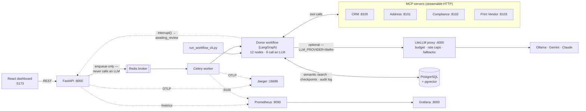

# PRF AI Pipeline

[](https://github.com/umeshkedimi/prf-ai-pipeline/actions/workflows/ci.yml)

**An agent harness for fundraising campaigns.** A campaign is a list of 10 to 2,000 donors, and its real problems are systemic: one bad import column breaking dozens of addresses, a duplicate pair, a state the organisation may not solicit in. A single **campaign agent** prepares such a list for mailing. It profiles the data, fixes what is fixable (with a human's approval), launches donor runs in batches under a budget, reads the outcomes, and reports what is ready, what is held and why.

It works inside a **harness**: permission tiers, hard budgets, approval gates, and an audited trajectory. It drives a **deterministic donor workflow** that turns each donor record into a compliant, print-ready letter, pausing for a person whenever a rule says the decision is too consequential to automate.

*PRF = Print Ready Format. The data is synthetic and every external system (CRM, address lookup, compliance registry, print vendor) is mocked behind a real MCP protocol layer. This is a reference architecture, not a deployed service.*

## At a glance

| | |
|---|---|
| **One agent, bounded** | Campaign agent over 8 tools in 4 permission tiers. It cannot edit donor data without a human, and cannot reach another campaign |
| **Donor workflow** | 12 LangGraph nodes, 6 of which call a model. Routing is a function of recorded facts, never of a model's number |
| **Measured, not asserted** | 8 eval suites against a committed baseline; every agent guard is scored on what the model *requested*, not on what the guard allowed |
| **Run anywhere** | Docker Compose, or Kubernetes (Kustomize, tested on kind). Local Ollama or a hosted model behind a LiteLLM proxy |
| **Size** | 269 unit tests, 12 migrations, 4 MCP servers, 13 services |

**In one sentence:** an agent profiles a donor list, asks permission to fix a systemic data defect, launches the donor workflow in batches, notices what failed and why, and returns a report whose numbers come from the database, while every tool it touched was allowlisted, budgeted, tiered, and recorded.

---

## Contents

- [Quick start](#quick-start)
- [Business context](#business-context)
- [Architecture](#architecture)
- [Repository layout](#repository-layout)
- [The campaign agent and its harness](#the-campaign-agent-and-its-harness)
- [The donor workflow](#the-donor-workflow)
- [The donor workflow stages](#the-donor-workflow-stages)
- [Human review](#human-review)
- [Status and confidence semantics](#status-and-confidence-semantics)
- [Data model](#data-model)
- [API reference](#api-reference)
- [Authentication and authorization](#authentication-and-authorization)
- [CSV donor ingestion](#csv-donor-ingestion)
- [Configuration reference](#configuration-reference)
- [Frontend (review dashboard)](#frontend-review-dashboard)
- [Running on Kubernetes](#running-on-kubernetes)
- [Observability](#observability)
- [LLM routing and cost control](#llm-routing-and-cost-control)
- [Demo: a whole campaign](#demo-a-whole-campaign)
- [The seed dataset](#the-seed-dataset)
- [Tests and CI](#tests-and-ci)
- [Evaluation framework](#evaluation-framework)
- [How it was built](#how-it-was-built)
- [Design decisions and trade-offs](#design-decisions-and-trade-offs)
- [Known limitations](#known-limitations)

---

## Quick start

**Prerequisites:** Docker + Compose, [`uv`](https://docs.astral.sh/uv/), Python 3.12+, an `OPENAI_API_KEY` (RAG embeddings need it at runtime even on a local model: `rag/retriever.py` embeds every query), and one model option below.

| Model option | Setup | Speed |
|---|---|---|
| **Hosted, cheapest (recommended to try it)** | in `.env`: `LLM_PROVIDER=litellm`, `LLM_MODEL=gpt-4o-mini` (the proxy holds the key and a $10 budget cap) | ~24 s per donor, tool call under 2 s |
| **Local Ollama (reference configuration, no cost)** | `brew services start ollama`, `ollama pull qwen2.5:14b`, `ollama pull llama3.1:8b`; the shipped `.env.example` already points here | ~40-60 s per donor |

```bash
cp .env.example .env                        # add OPENAI_API_KEY; pick a model option above
docker compose up -d postgres redis

cd backend
uv sync --extra dev
uv run alembic upgrade head
uv run python scripts/seed_db.py            # 12 labelled donors, d-0001..d-0012
uv run python scripts/seed_users.py         # dev admin: admin@prf.local / changeme123
uv run python scripts/ingest_knowledge.py   # embed campaign knowledge into pgvector
cd ..

docker compose up -d --build                # API, both workers, 4 MCP servers, LiteLLM, observability
curl localhost:8000/api/v1/health           # {"status":"ok"}
```

Then run the dashboard (`cd frontend && cp .env.example .env && npm install && npm run dev`, http://localhost:5173) or follow [Demo: a whole campaign](#demo-a-whole-campaign) with curl. The `pgdata` volume persists, so seeding is one-time; later sessions are just `docker compose up -d`. Port 9090 is often taken on a dev machine; if `prometheus` will not start, that is why.

### Service ports

| Service | Port | |
|---|---|---|
| API | 8000 | `/docs` for interactive OpenAPI |
| Frontend (Vite dev) | 5173 | |
| PostgreSQL | 5432 | + pgvector |
| Redis | 6379 | Celery broker |
| MCP: CRM / Address / Compliance / Print Vendor | 8100–8103 | streamable-HTTP |
| LiteLLM proxy | 4000 | OpenAI-compatible; `/v1/models` lists the served aliases |
| Celery metrics | 9100 | Prometheus scrape target (the donor worker) |
| Celery agent worker | — | consumes only the `agent` queue; no host port |
| Jaeger UI | 16686 | traces |
| Prometheus | 9090 | |
| Grafana | 3000 | anonymous admin, local-only |

### Common commands

```bash
cd backend
uv run pytest                              # unit, offline, ~2.3s
uv run pytest -m integration               # real stack + live LLM, ~4min
uv run ruff check .

uv run alembic upgrade head
uv run python scripts/run_evals.py                     # cheap suites
uv run python scripts/run_evals.py --include-expensive # + trajectory
```

## Business context

Nonprofits (animal rescue orgs, food banks, disaster relief, community welfare NGOs) run fundraising campaigns by mailing physical donation-request letters to previous donors. Input is donor data exported from a CRM; output is a print-ready PDF mailed by a print vendor.

```json
{
  "donor_id": "12345",
  "name": "John Doe",
  "address": "123 Main Street, Dallas, TX",
  "last_donation_amount": 100,
  "last_donation_date": "2025-04-01",
  "campaign": "Animal Rescue Mission"
}
```

Doing this by hand is slow and error-prone in ways that carry real consequence: mailing someone who asked not to be contacted, mailing a deceased donor's household, asking a $25/year donor for $5,000, mailing into a state the org isn't registered to solicit in, or printing a letter that promises an outcome a single gift can't deliver. Each of those is a distinct failure mode, and each maps to a stage of the donor workflow below.

## Architecture


```mermaid
flowchart LR
  UI["React dashboard<br/>:5173"] -->|REST| API["FastAPI :8000"]
  CLI["run_workflow_cli.py"] --> GRAPH["Donor workflow (LangGraph)<br/>12 nodes · 6 call an LLM"]

  API -->|"enqueue only —<br/>never calls an LLM"| Q[["Redis broker"]]
  Q --> W["Celery worker"]
  W --> GRAPH

  subgraph MCP["MCP servers (streamable-HTTP)"]
    CRM["CRM :8100"]
    ADDR["Address :8101"]
    COMP["Compliance :8102"]
    PV["Print Vendor :8103"]
  end

  GRAPH <-->|"tool calls"| MCP
  GRAPH -->|"optional —<br/>LLM_PROVIDER=litellm"| LLM["LiteLLM proxy :4000<br/>budget · rate caps · fallbacks"]
  LLM --> VENDOR["Ollama · Gemini · Claude"]
  GRAPH <-->|"semantic search ·<br/>checkpoints · audit log"| PG[("PostgreSQL<br/>+ pgvector")]
  GRAPH -.->|"interrupt() →<br/>awaiting_review"| API

  API -.->|OTLP| J["Jaeger :16686"]
  W -.->|OTLP| J
  API -.->|"/metrics"| PROM["Prometheus :9090"]
  W -.->|":9100"| PROM
  PROM --> G["Grafana :3000"]
```

Two layers, and the line between them is the point of the design:

| Layer | What it is | Who decides what happens next |
|---|---|---|
| **Campaign agent** + harness | One agent over a whole campaign: profile, dedupe, fix, launch in batches, read outcomes, report | A model, inside a harness (allowlist, tiers, budgets, approval gates) |
| **Donor workflow** | 12 LangGraph nodes that turn one donor record into a mailable letter | Deterministic routing over recorded facts. A model is called in 6 nodes, only for judgment |

The donor workflow's nodes, by whether a model is involved:

| Stage | Nodes | LLM? |
|---|---|---|
| Verification | `fetch_core_data` · `gather_context` (tool loop) · `synthesize_verdict` | `gather_context`, `synthesize_verdict` — duplicate/suspicion judgment; eligibility itself is forced in code |
| Address | `check_address` | **No** — MCP verification + a decision table |
| Ask | `recommend_ask` | **No** — RFM, ladder, and a segment → rung policy |
| Letter | `personalize_letter` · `revise_letter` | Yes — drafting inside a fixed tone |
| Compliance | `gather_disclosures` · `review_letter_compliance` | `review_letter_compliance` only — registration and disclosure text are lookups |
| Fulfilment | `generate_pdf` | **No** |
| Human review | `human_review` · `reconcile_decision` | `reconcile_decision` only — reviewer notes → letter guidance; it cannot route |

### The three architectural boundaries

These are the load-bearing decisions. Everything else follows from them.

**1. The determinism boundary.** Deterministic work (MCP calls, compliance flags, RFM scoring, ask-ladder arithmetic) is done in plain Python; only genuine judgment is delegated to the LLM. **Money amounts are computed, never generated.** Critically, every *blocking* human-review gate routes off a deterministic value — the ask amount, the state-registration flag — never off a model-produced confidence float. Routing a blocking pause off a non-deterministic float would let the same donor take different paths on identical data, which is unacceptable when the output is a physical letter.

**2. The data boundary.** Structured donor/CRM/donation data lives in PostgreSQL and is queried relationally. RAG (vector search) is used *only* for unstructured campaign knowledge — annual reports, impact stats, success stories, compliance guidelines. **Donor PII is never embedded.** Semantic similarity is the wrong retrieval mechanism for "what did this donor give last year," and embedding PII into a vector store creates an exfiltration surface with no upside.

**3. The execution boundary.** The API never invokes an LLM — it validates, persists, and enqueues, then returns `202`. All model work happens in the Celery worker. This keeps request latency bounded and independent of model latency (a full run is ~30s), and means a model outage degrades throughput rather than taking down the API.

**MCP servers.** CRM, Address, Compliance, and Print Vendor are each a *real* MCP protocol server (FastMCP, streamable-HTTP), backed by synthetic/mocked data. The protocol is genuine — agents reach external systems only through auditable, tool-mediated calls via `langchain-mcp-adapters`; only the data behind them is fake. Swapping a mock for a real vendor is a URL change, not a refactor.

**Stack:** FastAPI, LangGraph, PostgreSQL (+ pgvector), Redis, Celery, Docker, OpenTelemetry, Prometheus, Grafana, Jaeger, React.

## Repository layout

```
.
├── backend/
│   ├── src/app/
│   │   ├── agents/<name>/      agent.py (graph nodes) + prompts.py + schemas.py
│   │   │                       └── plus rules.py / rfm.py / render.py / eligibility.py /
│   │   │                           reconcile.py where the agent has deterministic logic
│   │   │                           (or a bounded LLM step) to keep out of the main node
│   │   ├── graph/              builder.py (StateGraph + routing), state.py,
│   │   │                       checkpointer.py, tracing.py
│   │   ├── mcp_servers/        real FastMCP streamable-HTTP servers
│   │   │                       (crm, address, compliance, print_vendor)
│   │   ├── mcp_clients/        MultiServerMCPClient wrappers + response parsing
│   │   ├── rag/                pgvector retrieval — embeddings, store, retriever
│   │   ├── evals/              harness (types, runner, scorers, report, store)
│   │   │                       + suites/ (8 suites)
│   │   ├── workers/            Celery app + tasks + Prometheus metrics, plus
│   │   │                       release_claims.py / run_recovery.py / agent_recovery.py
│   │   │                       (stuck-work recovery) and agent_tasks.py (the agent queue)
│   │   ├── campaigns/          membership, set-level queries, outcome reasons, status sync,
│   │   │                       synthetic planted-defect campaigns — Phase 10
│   │   ├── harness/            tool gateway, permission tiers, budgets, agent-run store,
│   │   │                       the campaign tool registry — Phase 10
│   │   ├── campaign_agent/     the agent loop, prompts, runtime wiring, report — Phase 10
│   │   ├── donors/             CSV ingestion (parse, validate, upsert) — Phase 9b
│   │   ├── api/v1/endpoints/   FastAPI routes (auth, donors, campaigns, agent, workflow, health)
│   │   ├── db/models/          SQLAlchemy models
│   │   ├── schemas/            Pydantic request/response schemas
│   │   └── core/               config, llm factory, audit, logging, telemetry, security
│   ├── knowledge/              markdown corpus ingested into pgvector (6 docs)
│   ├── alembic/versions/       12 migrations
│   ├── scripts/                seed_db, seed_users, ingest_knowledge, run_evals, run_workflow_cli
│   ├── evals/results/          baseline.json (committed), latest.json (gitignored)
│   ├── storage/letters/        generated PDFs (gitignored)
│   └── tests/                  unit/ (offline, mocked) + integration/ (live stack)
├── frontend/                   Vite + React + TypeScript review dashboard
├── observability/              Prometheus config + Grafana provisioning/dashboard
├── litellm/                    proxy config — model aliases, budget + rpm caps
├── k8s/                        Kustomize base + overlays/kind
├── .github/workflows/ci.yml    ruff check + offline unit suite
└── docker-compose.yml          13 services
```

Every stage directory follows the same shape, so a reviewer who reads one can navigate all of them. Where a stage has deterministic logic, it lives in its own module (`rfm.py`, `rules.py`, `render.py`) rather than inside `agent.py` — that separation is the determinism boundary made visible in the file tree.

## The campaign agent and its harness

A campaign holds 10 to 2,000 donors. A reviewer cannot read every run, and the interesting failures are *systemic* — one bad import column breaking 80 addresses, a duplicate pair, a state the org cannot solicit in. That is a different problem from processing one donor, and it is where an agent earns its place: the work is open-ended (no fixed graph can say what to do about the failures *this* list has), it can be checked, and the cost of a wrong move can be bounded.

```
Admin: "Prepare this campaign for mailing"
  → POST /campaigns/{id}/agent/run  → Celery (queue: agent)
       think ─▶ act ─▶ think ─▶ …            (LangGraph; checkpointed, resumable)
                 │
        every tool call goes through the HARNESS GATEWAY
                 │  budget → allowlist → argument validation → precheck
                 │  → permission tier → (human interrupt) → execute → audit
                 ▼
        profile_campaign · find_duplicate_pairs · cluster_failures · list_donors_by_status
        wait_for_runs · launch_donor_runs (act) · pad_postal_codes (irreversible) · propose_action
```

**The harness (`app/harness/`)** is plain Python the model cannot argue with:

- **Permission tiers.** `read` and `propose` are free; `act` is charged against a donor-run budget; `irreversible` (editing donor records) *never executes without a human*. `approved` is a parameter of the gateway call, not part of the agent's arguments, and every argument model forbids unknown keys — a model that passes `approved: true` gets an error back.
- **Budgets.** Hard caps on steps, tokens and donor runs. Every attempted call costs a step *including denied and invalid ones*, so an agent that keeps retrying a forbidden action still terminates. The run budget is pre-checked against what was asked and charged for what actually launched.
- **Scope.** No tool takes a `campaign_id`; each is bound to one campaign when built. The agent cannot reach another campaign whatever it is told.
- **Errors are observations.** A denied, invalid or failed call comes back as data the model can react to; nothing raises into the loop.
- **A trajectory you can replay.** Every call (and every human decision) is a row in `agent_steps`; the final report's numbers come from the database and that trail, with the model's own summary included but labelled as its words.
- **Durability.** `agent_runs` carries status, budget usage, the call awaiting a human, and a heartbeat. A paused run is claimed with one conditional `UPDATE` (two reviewers cannot both resume it); a run whose worker died is detected by its quiet heartbeat and continued from its checkpoint.

**Rules that are enforced in code because prompting them failed** — each was found by running the agent live, not by reasoning about it:

| Found live | Enforced as |
|---|---|
| The model flagged a duplicate pair, then launched *both* members | `launch_donor_runs` refuses the second member of any probable-duplicate pair |
| The model invented donor ids (`donor-1234`) to "fix" | `pad_postal_codes` prechecks ids and refuses *before* any human is asked; `profile_campaign` returns the ids so there is nothing to guess |
| The model said "done" mid-plan with work still queued | A completion check compares the claim to the database and sends it back (at most twice) |
| The agent task deadlocked the donor runs it launched | The agent runs on its own queue and worker (`celery-agent-worker`) |
| The run budget was charged for ids requested, not donors launched | Charged for what happened |

**What it deliberately cannot do.** It cannot change money, an ask amount, a disclosure, or a donor's eligibility — those stay in the deterministic per-donor workflow it launches. It proposes; code or a human executes.

**How it is measured** (`campaign_agent` eval suite, see [Evaluation framework](#evaluation-framework)): four synthetic campaigns with a ground-truth manifest of planted defects — malformed ZIPs, duplicate pairs, unregistered states, an opted-out donor — plus a *clean* control that catches false alarms. The per-donor workflow and the human reviewer are simulated so the suite measures the agent's judgment, not the pipeline's speed. Scores use what the model *requested* (the audit args), with `_effective` twins for what survived the guards.

## The donor workflow

12 nodes, 6 of which call a model. Every node is a real checkpoint boundary — the graph can crash and resume at any of them. This is the engine the campaign agent drives (`launch_donor_runs` starts one run per donor); it is also runnable alone via `POST /workflow/run`.

```
START → fetch_core_data → gather_context → synthesize_verdict
           │
           ├─ ineligible → END
           │
           └─ eligible → check_address        [MCP + decision table, no LLM]
                            │
                            ├─ confidence < threshold → human_review [interrupt, stage=address]
                            ├─ deliverable → recommend_ask
                            └─ confident but undeliverable → END   (nothing to mail)
                                            │
        (address review resumes) ───────────┤
                            ├─ now deliverable → recommend_ask
                            └─ rejected → END
                                            │
                                     recommend_ask   [RFM + ladder + rung policy, no LLM]
                                       │
                                       ├─ ask ≥ major-gift threshold
                                       │      → human_review [interrupt, stage=recommendation]
                                       │            ├─ approved/modified, ask > 0 → personalize_letter
                                       │            └─ rejected (ask zeroed) → END
                                       └─ else → personalize_letter   [RAG over campaign knowledge]
                                                       │
                                     personalize_letter → gather_disclosures
                                                       │
                                                       ├─ not registered to solicit in-state
                                                       │      → human_review [interrupt, stage=compliance]
                                                       │            ├─ approve/modify → review_letter_compliance
                                                       │            └─ reject → END
                                                       └─ registered → review_letter_compliance
                                                                          [RAG over compliance guidance]
                                                                          │
                                                                          ├─ disapproved, revisions < cap
                                                                          │      → revise_letter → review_letter_compliance
                                                                          └─ approved, or cap reached
                                                                                 → generate_pdf → END
                                                                                [Print Vendor MCP; the order is
                                                                                 skipped (letter held) if still
                                                                                 disapproved]
```

Every `human_review` exit passes through `reconcile_decision` before the resume routing shown above. It turns the reviewer's notes into letter-writing guidance (skipped for a reject, at the compliance stage, and for empty notes) and cannot change where the run goes — with one exception owned by `human_review` itself: a donor who became do-not-contact or suppressed *while the run was paused* ends the run whatever the reviewer decided.

In `graph/builder.py` these are assembled as two named units onto one flat `StateGraph` — a **verification unit** (`fetch_core_data` → `gather_context` → `synthesize_verdict` → `check_address`) and a **fulfillment unit** (`recommend_ask` → `personalize_letter` → `gather_disclosures` → `review_letter_compliance` → `generate_pdf`), wired through the shared `human_review` gate.

This is deliberately a *code-organization* split, not LangGraph nested subgraphs. Nested subgraphs can only be entered at their own `START`, but `route_after_human_review` resumes **mid-unit** — into `recommend_ask`, `personalize_letter`, or `review_letter_compliance` depending on which stage paused. Nested subgraphs cannot express that, so using them would have meant contorting resume semantics to fit a diagram. A supervisor/dynamic-routing rewrite was also considered and rejected: it would spread runtime-decided routing across the whole pipeline shape, cutting directly against the determinism boundary.

## The donor workflow stages

> **Read this first.** These are *stages of a workflow*, not autonomous agents. For one donor the order of work is fixed, the routing is a deterministic function of recorded facts, and a model is called only where judgment is needed (is this a duplicate? is this letter's wording risky?). Two stages used to call a model and no longer do — see below. The one place a model genuinely decides *what happens next* is the [campaign agent](#the-campaign-agent-and-its-harness), which operates a whole list of donors.

**Donor Verification** (Phase 1) — 3 nodes:

1. **`fetch_core_data`** — deterministic `get_donor_profile` MCP call. `do_not_contact`/suppression flags are read as-is, never inferred by the LLM.
2. **`gather_context`** — an LLM bound to `get_donation_history` + `find_potential_duplicate_donors` (via `langchain-mcp-adapters`, a real streamable-HTTP MCP server), in a bounded tool-calling loop.
3. **`synthesize_verdict`** — structured-output LLM call (`eligible`, `confidence`, `reason`, `is_duplicate`, `is_suspicious`, `reasoning[]`). The prompt tells the model do-not-contact and suppressed donors are ineligible, but that is **not** left to the prompt: `enforce_eligibility` (`agents/donor_verification/eligibility.py`) forces `eligible` to `False` in code whenever the CRM flag is set, and records the model's pre-correction verdict in the audit trail when it had to. It is one-directional — it can only remove eligibility, never grant it — and leaves confidence untouched. (This was previously only prompted, while the routing docstring described it as enforced; the same instructed-not-enforced gap the ask-ladder guard closed.) "Eligible" is scoped strictly to compliance/legitimacy — the model is explicitly told *not* to factor in address deliverability, which is a separate downstream concern.

**Address Intelligence** (Phase 2) — 1 node, only reached if the donor is eligible:

1. **`check_address`** — deterministic end to end. Verifies the address through the Address MCP tool, calls `lookup_new_address` only when the donor moved, then applies the decision table in `agents/address_intelligence/rules.py`. Donors with no address on file skip the tools entirely.

   This was two nodes, the second an LLM call whose prompt was, line for line, this table (invalid or vacant → low confidence; moved with a forwarding address → weigh the forwarding confidence; clean → high). Nothing in it needed judgment, and handing it to a model let the confidence drift: a vacant address with no forwarding lookup was once scored a flat 1.0, and the model's `moved` flag was not stable across models. As code it is the same table, unit-tested, identical on every run. Confidence means *certainty about the deliverability verdict*, which is what `route_after_address` gates on: a certain "deliverable" flows on, a certain "undeliverable" (vacant) ends the run, and an uncertain verdict — a donor who moved with an unsure forwarding match, or no address on file — pauses for a person.

**Donation Recommendation** (Phase 3) — 1 node, only reached for a donor we can actually mail:

1. **`recommend_ask`** — deterministic end to end. Recency/Frequency/Monetary scoring and the 3-rung ask ladder (typical → step-up → aspirational) are formulas over giving history; the rung is chosen by a segment policy (`rfm.choose_ask`: lapsed and prospect donors are asked gently at the typical rung, everyone else at the step-up rung, never the aspirational one); the confidence is the strength of the giving evidence (thin history lowers it; an excluded outlier caps it). Reuses the `donation_history` `gather_context` already fetched.

   This was two nodes, the second an LLM + RAG call that picked a rung and justified it. Measured against the audit log, the model dropped `recency_days` on 15 of 15 runs and flipped d-0006's outlier flag on 3 of 15, so a guard was written to restore the computed fields and snap the ask back onto the ladder. The better fix was to stop asking: the choice follows a fixed rule, the output is *money*, and the major-gift gate routes on it. The judgment a model adds lives in the letter and the compliance review, where it belongs.

The ladder is **outlier-robust**: if the top gift dwarfs the rest of the history (>5× the median), it's treated as a likely data-entry error or one-off windfall and the anchor falls back to the median, recorded as `outlier_gift_excluded`. Without this, d-0006's anomalous $50,000 donation — the very record Donor Verification flags as suspicious — would have produced a $125,000 ask.

**RAG** (Phase 3) — semantic search over *unstructured campaign knowledge* only (impact stats, program outcomes, success stories, ask-strategy and stewardship guidelines) in `backend/knowledge/`, chunked by heading, embedded with OpenAI `text-embedding-3-small` and stored in a pgvector `knowledge_chunks` table with an HNSW cosine index. **Donor PII is never embedded** — structured donor data stays in the relational tables. Embeddings are provider-agnostic via LangChain `init_embeddings`, mirroring how `get_llm()` handles chat models. Re-ingest is idempotent (delete-and-reinsert per document).

**Campaign Personalization** (Phase 4) — 2 nodes (`personalize_letter`, plus `revise_letter` for the bounded compliance rewrite loop), reached once an ask survives the recommendation stage:

1. **`personalize_letter`** — a deterministic tone lookup keyed on the donor's RFM segment (gentle/reconnecting for lapsed, an invitation to step up for loyal, personal/relationship-based for major — the same segment vocabulary `recommend_ask` uses), then an LLM drafts the appeal letter within that fixed tone, grounded in retrieved stewardship and impact knowledge. The model never chooses the tone and never invents a cited figure; it only drafts. A rejected recommendation (ask zeroed by `human_review`) skips this node entirely — there's nothing to personalize for a $0 letter.

**Compliance** (Phase 5) — 2 nodes, reached once a letter has been drafted:

1. **`gather_disclosures`** — deterministic `get_disclosure_requirements` MCP call keyed on the donor's state. Whether the org is registered to solicit there at all is a legal fact, not a judgment call — if not, there is no letter-content review to make, so the graph pauses immediately rather than spending an LLM call on wording for a letter that can't legally mail regardless.
2. **`review_letter_compliance`** — only reached when registered. Retrieves compliance guidance from pgvector and has an LLM judge the drafted letter for donor-rights/tax-language risk (`approved`, `confidence`, `flagged_issues[]`, `reasoning[]`). Required disclosures are merged in afterward from `gather_disclosures`' output, **never routed through the LLM** — legal boilerplate is not something a model should be asked to reproduce. `approved: false` routes the run to `needs_review` and, once the revise loop is exhausted, **holds the letter back from the print vendor** (see `generate_pdf`).

   **Critique → revise loop.** Before falling through, a disapproved letter is sent to `revise_letter` (in `campaign_personalization`), which redrafts with the previous draft and the reviewer's `flagged_issues` in the prompt, then goes back to `review_letter_compliance` (not `gather_disclosures` — disclosures depend only on the donor's state). Capped at `MAX_LETTER_REVISIONS` (default 2) by a plain counter, `letter_revisions`, so the loop is bounded by code, never by the model deciding it is done. This routes off the model's `approved` boolean, which the determinism boundary normally avoids; it is acceptable here because the loop is advisory and bounded — a misjudgement costs one extra or one skipped draft — while the blocking compliance gate (state registration) still never reads model output. Each rewrite writes its own `revise_letter` audit row including the feedback it received. The trajectory eval strips rewrite cycles from the recorded path (`collapse_revisions`): whether a draft needed rewriting is model judgment, and scoring it would make `node_path_exact` grade drafting quality instead of routing.

**PDF Generation** (Phase 6) — 1 node, the pipeline's terminus:

1. **`generate_pdf`** — fully deterministic, **no LLM call at all**: every judgment the letter needed (copy, risk review) already happened upstream, so what's left is mechanical layout and a vendor order. Renders a print-ready single-page PDF (`reportlab`) styled as a real appeal letter — a letterhead (org name, tagline, contact line, accent-color rule), the dated recipient block, the drafted salutation/body/closing, a highlighted "your gift today" callout box built from the deterministic `recommended_ask` (never the letter's own prose — same non-LLM-boilerplate reasoning as the disclosures), a signature block, a P.S. line, the required disclosures, a QR code encoding a donation-tracking URL, and a Code128 barcode encoding a deterministic mail-piece reference (`sha256(workflow_run_id)[:8]` — stable across re-renders, distinct per run, so eval assertions can predict it). Body text wraps by actual glyph width (`pdfmetrics.stringWidth`), not a fixed character count, since the letter fonts are proportional. **The vendor order is the pipeline's one irreversible side effect, so it is gated on Compliance:** a letter still disapproved after the revise loop is rendered (a reviewer can read it via `GET /workflow/{id}/pdf`) but no order is submitted — `pdf_result` carries `held: true`, a `hold_reason` taken from the flagged issues, and null order fields. Only an explicit `approved: false` holds; a missing verdict does not. A human can then release or discard a held letter (see *Releasing a held letter* under Human review). Otherwise it submits the reference to the mocked Print Vendor MCP server and merges its order confirmation (`vendor_order_id`, `tracking_number`, `postage_class`, `turnaround_days`, `cost`) into `pdf_result`. The org identity in the letterhead (address, phone, signer name) is invented, synthetic detail, the same fictional-but-consistent convention as the rest of the seed data.

## Human review

The platform's genuine pause: a real LangGraph `interrupt()`, not a status flag. One node serves **three review stages**, discriminated by checking most-downstream-first (each later stage's result key only exists once the one before it is resolved, so ordering makes this reliable):

| Stage | Trigger | Deterministic? | On resume |
|---|---|---|---|
| **address** | Address confidence below threshold (0.80) | **Yes** — a decision table over MCP facts (`check_address`); no model | Continues to recommendation if now deliverable; stops if rejected |
| **recommendation** | Ask ≥ `MAJOR_GIFT_ASK_THRESHOLD` ($1,000) | **Yes** — a dollar amount | Continues to personalization if the (possibly human-adjusted) ask is still positive; stops if rejected |
| **compliance** | Org not registered to solicit in donor's state | **Yes** — a legal flag | Continues into letter-content review then PDF if approve/modify; ends the run if rejected |

The workflow genuinely cannot proceed until a decision (`approve`/`reject`/`modify`) arrives via `POST /workflow/{id}/review`. The decision — action, reviewer, notes — is always recorded for the audit trail regardless of outcome.

**`reconcile_decision` — reasoning after the decision.** Between `human_review` and the resume routing, one node reads the reviewer's free-text `notes` and extracts *writing guidance* for the letter (e.g. "donor recently lost her husband — keep it gentle"), which `personalize_letter` and `revise_letter` receive as a lower-priority prompt section. Boundaries, each deliberate:

- **It cannot route.** `route_after_human_review` still reads only the deterministic decision and state. An early design had the model choose a re-entry node; reading the code showed there is no legitimate alternative — re-running `compute_rfm` would overwrite a human-adjusted ask, and re-verifying a corrected address needs a structured address, not the free-text one the reviewer typed — so that choice would have been theater.
- **It cannot touch the ask, tone label or disclosures.** The prompt forbids it, and none of those fields are writable from its output.
- **Human-influenced text is still reviewed.** The drafted letter goes through Compliance and the revise loop like any other draft.
- **It spends no LLM call when there's nothing to interpret.** Skipped deterministically on reject, at the compliance stage (drafting is already done), and on empty notes. Guidance from an earlier pause is kept when a later pause adds more.
- **Audited under its own agent name** (`decision_reconciliation`), not `human_review` — `review_history` is built from `human_review` rows, and a reconciliation is not a human decision.
- **Guidance is advisory, not guaranteed.** A live d-0011 run with "keep it gentle, don't pressure" produced a letter that acknowledged long-standing loyalty but still said "step up this commitment" — the model follows guidance imperfectly, and the ask itself is fixed by the ladder. Reviewers who need a different amount use `modify`.

### Concurrent reviewers, and a paused run that goes stale

**Two reviewers on the same pause.** `POST /review` claims the run with one conditional `UPDATE` (`awaiting_review` → `running`) that also requires the decision's `stage` to equal the stage the run is paused at, so exactly one reviewer wins and the other gets `409`. This was a real bug, not a theoretical one: with no claim, both decisions were enqueued, and the second resume was consumed by whichever interrupt the graph reached *next* — checked directly against LangGraph, a reject meant for the address stage was applied to the recommendation stage; if no further pause existed it was silently dropped, with a `202` and a clean audit trail. `stage` is required precisely because the request used to carry nothing tying a decision to the pause it was made for. If the broker is down the claim is handed back (`503`) rather than stranding the run in `running`.

**Data that changes while a run is paused.** `donor_profile` is a snapshot from before the pause, and a run can wait days. Re-reading everything on resume would make a reviewer's decision about data they never saw, so only the two *hard* eligibility facts are re-read: after any non-reject decision `human_review` re-fetches the donor's `do_not_contact` / `is_suppressed` flags, and a donor who opted out or was suppressed in the meantime ends the run (`completed`, nothing mailed, `verification_result.revoked_during_review`) whatever the reviewer decided. The recheck is recorded in the audit row. A reject skips it — it ends the run anyway, and a CRM outage shouldn't be able to block a reject; for the others a failed lookup fails the run loudly, the same as any other CRM call, rather than silently skipping the check.

Deliberately not handled: other snapshotted data (address, state registration) is not refreshed; routing thresholds read at resume time, so a config change during a pause applies from the next routing decision; and a paused run resumes on the *new* code after a deploy — adding a node is safe (that is how `reconcile_decision` shipped), renaming or removing one a paused run depends on is not, and there is no pause expiry.

### Stalled runs

A run's status becomes `running` when a Celery task starts it, and only that task moves it on. If the worker is killed mid-graph the message was already acknowledged, so the broker never redelivers it and the run reads `running` forever — reproduced by killing the worker container six nodes into a d-0001 run. The work is not lost: the graph checkpoints after every node, so recovery is *detect* and *continue from the checkpoint*.

- **Detect.** Every node stamps `workflow_runs.heartbeat_at` as it starts (`traced_node`), so the TTL (`RUN_STALL_TTL_SECONDS`, 600) only has to exceed the slowest *single node*, not a whole run. Only `running` runs with no `result` yet qualify; a held-letter release also sits in `running` but has its own recovery.
- **Claim, then continue.** Takeover is a compare-and-swap with the staleness test inside the `UPDATE`'s `WHERE`, so two recoverers can't both resume one run. The recovered task calls the graph with no input, which continues from the last checkpoint; if the worker died before the first checkpoint existed it starts fresh instead.
- **When it runs.** On worker start, and again once the TTL has elapsed. The second sweep is the one that matters: a worker that crashes and restarts quickly leaves a heartbeat that is still *fresh* at startup, so an immediate sweep correctly ignores it — it can't tell dead from slow. Verified live: a run killed after six nodes resumed from `recommend_ask` (no repeated nodes) roughly TTL after the worker came back, and completed with a real order.
- **Why re-running the interrupted node is safe.** Reads repeat harmlessly, the PDF render overwrites the same file, the vendor order is keyed on the run's deterministic reference, and a node's output only reaches state when it completes. The cost is a repeated LLM call and a duplicate audit row.

Not covered: no periodic sweeper (a worker that dies and is never restarted waits for the next start — a Celery beat process would close that); runs from before the heartbeat column existed have none and are never recovered; a run that is merely very slow *past the TTL* on one node could be resumed while the original is still alive (the TTL is the guard, and it is generous); and a run stuck in `pending` because its message was lost is not detected.

### Releasing a held letter

A letter Compliance still disapproves after the revise loop is rendered but never ordered (`pdf_result.held`), leaving the run in `needs_review`. `POST /workflow/{id}/release` lets a human decide it: **release** places the print order and completes the run; **discard** closes it as `discarded` and nothing is ever mailed. A reason is required either way, and the reviewer identity comes from the session, not the body.

Why a separate endpoint rather than `/review`: `/review` resumes a graph paused on an `interrupt()`. This run already reached `END` — there is nothing to resume, only one irreversible side effect to allow or forbid — so a different resource action with different semantics (and a different error contract) is the honest shape.

What makes it safe to expose:

- **Atomic claim.** The endpoint takes the run with a single conditional `UPDATE ... WHERE status='needs_review' AND held` — two simultaneous releases cannot both win; the loser gets `409` and no second order is placed. Verified live with two concurrent requests: one `202`, one `409`, exactly one vendor call.
- **Failure is recoverable.** If the broker is down the claim is rolled back (`503`); if the vendor call fails the task returns the run to `needs_review`, still held, with the error recorded. A run is never stranded in `running` by a handled failure.
- **One place places orders.** `generate_pdf` and the release task share `submit_print_order`, and the order is keyed on the deterministic reference.
- **The override is on the record.** Recorded in `review_history` as a `release`/`discard` decision with reviewer and reason. The Compliance verdict itself is left as `approved: false` — a human overruling it doesn't rewrite it, matching the rule that approval never inflates a recorded result.

**Stuck-claim recovery.** Releasing is two steps that can't be one transaction — claim the run, then place the order in a Celery task — so a process can die between them or mid-task, leaving a run in `running` that nothing will advance. An idempotency key alone doesn't fix that: it makes a retry *safe* (here the order is keyed on the run's deterministic reference, so a repeat can't double-order) but nothing *performs* the retry. So recovery has both halves:

- **Detect.** Each claim stamps `release_claim` (when, who, why) into `pdf_result`; a claim older than `RELEASE_CLAIM_TTL_SECONDS` (300) is stale. Takeover is a compare-and-swap with the staleness test inside the `UPDATE`'s `WHERE`, so a claim refreshed or completed between read and write is refused rather than duplicated.
- **Retry, automatically and manually.** A restarted worker sends `recover_stale_releases` on `worker_ready` — immediately, and again once the TTL has elapsed (a worker that crashes and restarts quickly leaves a claim that is still *fresh* at startup, so only the delayed sweep can call it stalled) — which re-enqueues each stale claim with its *original* reviewer and notes. A reviewer can also call `POST /release` again on a run stalled past the TTL (the dashboard offers a Retry button); a fresh claim still gets `409`.
- **The release task is idempotent**: if the run is no longer a held, claimed release it does nothing, so a duplicate or redelivered task cannot order twice.

Verified live: planted two stale claims, recovered one by restarting the worker (completed under the original reviewer's name) and the other through the endpoint; both ended `completed` with an order.

Not covered, deliberately: recovery runs at worker start (twice, see above) and on demand, not on a timer (a periodic sweeper needs a Celery beat process — new infrastructure in compose and k8s — so a worker that dies *and is never restarted* waits for a manual retry); a claim made before this mechanism existed has no stamp and is not recovered; both roles may release (no policy distinguishes them yet); and the mock vendor is idempotent by construction where a real one would need an idempotency key.

Donor Verification's low-confidence outcomes (duplicate/suspicious) stay **advisory-only**, per the spec's trigger list (address confidence, ask amount, compliance, missing info — not "possible duplicate").

**Why the address gate is the only non-deterministic one.** It gates *enrichment quality*, not a consequential business decision — a wrong call means a wasted stamp, not an illegal solicitation or a five-figure ask. The two gates whose failure modes carry legal or financial weight both route off deterministic facts.

## Status and confidence semantics

- **`pending`** / **`running`** — self-explanatory, with one caveat: `running` means *some process claims to be executing this run*. If that process dies the status stays put, so every node stamps `heartbeat_at` and a `running` run that goes quiet is recovered (see *Stalled runs* under Human review).
- **`awaiting_review`** — the graph is genuinely paused on an interrupt; `pending_review` holds the payload. Cannot proceed without `POST /workflow/{id}/review`.
- **`needs_review`** — an advisory, *non-blocking* flag: the graph already reached `END`, nothing is stuck, it just means a low-confidence or disapproved outcome is worth a human glance eventually.
- **`completed`** — reached `END` cleanly, or a paused workflow was resumed with a decision (a human's call is authoritative — no further confidence gating applies to the stage they signed off on).
- **`failed`** — the task raised; the error is recorded on the run.
- **`discarded`** — terminal: a human decided a held letter must never be mailed (see *Releasing a held letter*).

Status and confidence are driven by the **terminal stage** a run reached, plus a per-result `human_reviewed` flag — not by whether any human decision happened somewhere along the way. That distinction compounds with each phase: an address-stage review stopped being terminal at Phase 3, recommendation at Phase 4, personalization at Phase 5, compliance at Phase 6.

`generate_pdf` has no LLM call of its own, so a clean run terminating there reports **`confidence: null`** — not a failure to report a number, just nothing left to score once every upstream judgment has already run. A run blocked on state registration before any letter-content review ran also reports `null`, for the same reason earlier in the pipeline.

**Confidence is never inflated.** A human approving a low-confidence result does not raise the recorded confidence — the number stays as the stage reported it, with `human_reviewed: true` alongside.

`workflow_runs.result` aggregates every agent that ran:

```json
{
  "donor_verification":       {},
  "address_intelligence":     {},
  "donation_recommendation":  {},
  "campaign_personalization": {},
  "compliance":               {},
  "pdf_generation":           {},
  "human_review":             {}
}
```

Keys are omitted for agents that never ran, so a reviewer sees the whole picture rather than just the last agent's output.

## Data model

| Table | Purpose |
|---|---|
| `donors` | Donor records with `external_id` (the CRM-facing code, e.g. `d-0009`), name, address, state |
| `donations` | Giving history — the input to RFM scoring |
| `campaigns` | Campaign metadata |
| `suppressions` | Do-not-contact / deceased / bounced suppression flags, read as fact by `fetch_core_data` |
| `workflow_runs` | One row per pipeline run: `status`, `current_agent`, `confidence`, `result` (JSONB), `pending_review` (JSONB), timestamps, `heartbeat_at` (last sign of life; see *Stalled runs*), `error`. Status also includes `discarded` — a held letter a human decided never to mail |
| `agent_audit_log` | **One row per agent decision** — input snapshot, output, confidence, reasoning, tool calls, model, latency, `input_tokens`/`output_tokens`. The explainability trail |
| `knowledge_chunks` | pgvector store — heading-chunked campaign knowledge, 1536-dim, HNSW cosine index. **No PII** |
| `eval_runs` | Persisted eval history: suite, metrics, `git_sha`, `llm_model`, `judge_model` |
| `users` | Login accounts — email, hashed password, `admin`/`reviewer` role (Phase 9a) |
| `donor_imports` | One row per CSV upload — uploader, filename, insert/update/reject counts, full rejected-row detail (Phase 9b) |
| `checkpoints` (LangGraph) | Durable graph state, dedicated schema — what makes crash/resume real |

**Every node writes to `agent_audit_log`** — this is what `GET /workflow/{id}?verbose=true` exposes. `personalize_letter` and `review_letter_compliance` additionally record which knowledge chunks were retrieved and their cosine distances, so a reviewer can see exactly what each was grounded in.

`review_history` is **derived** from `agent_audit_log` (rows where `agent_name = "human_review"`) rather than stored in its own column. A run can pause up to three times, and the audit log already accumulates one row per decision — a second table would have been a redundant source of truth that could drift.

## API reference

Base path: `/api/v1`. Interactive docs at `http://localhost:8000/docs`.

| Method | Path | Purpose |
|---|---|---|
| `GET` | `/health` | Liveness probe → `{"status": "ok"}` |
| `POST` | `/auth/login` | Body `{"email", "password"}` → `{"access_token", "token_type"}` |
| `GET` | `/auth/me` | The authenticated user |
| `POST` | `/auth/users` | Admin-only. Create a user — `{"email", "full_name", "password", "role"}` |
| `GET` | `/auth/users` | Admin-only. List all users |
| `POST` | `/donors/ingest` | Admin-only. Multipart CSV upload — upserts by `external_id`, never starts a run. Returns per-row insert/update/reject counts |
| `GET` | `/donors/unrun` | Donors with zero workflow runs — the staging list for a batch trigger. Query: `limit` (default 200) |
| `POST` | `/campaigns` | Admin-only. Create a campaign `{"name", "appeal_code"?}` |
| `GET` | `/campaigns` · `/campaigns/{id}` | List campaigns · one campaign with donor counts by status |
| `POST` | `/donors/ingest?campaign_id=` | (as above) with `campaign_id`, uploaded donors are attached to that campaign as `staged` |
| `POST` | `/campaigns/{id}/agent/run` | Admin-only. Start the campaign agent `{goal?, max_steps, max_tokens, max_runs}`; `202`, runs asynchronously |
| `GET` | `/campaigns/{id}/agent-runs` | Recent agent runs for a campaign |
| `GET` | `/agent-runs/{id}` | One agent run: status, budget usage, pending approval, final report, and the full step trajectory |
| `POST` | `/agent-runs/{id}/approval` | Admin-only. Answer the call the agent is paused on `{tool, approve, notes?}`. `409` if nothing is pending, `tool` doesn't match, or another reviewer answered first |
| `POST` | `/workflow/run` | Start a run. Body `{"donor_id": "d-0009"}`. Returns `202` + the run record |
| `POST` | `/workflow/run/batch` | Body `{"donor_ids": [...]}`. Enqueues one run per donor; a bad id is reported per-item, not fatal to the batch |
| `GET` | `/workflow/reviews` | Review queue — `awaiting_review` + `needs_review` runs, oldest first. Query: `status`, `limit` (default 50), `offset` |
| `GET` | `/workflow/runs` | Full run history, any status — unlike `/reviews`, not scoped to what needs action. Newest first. Query: `status` (any of the six), `limit` (default 50), `offset` |
| `GET` | `/workflow/{id}` | Full run: status, `result`, `pending_review`, `review_history`. Add `?verbose=true` for the audit log |
| `POST` | `/workflow/{id}/review` | Submit a human decision. `stage` is required and must match the stage the run is paused at. Returns `202`; resumes asynchronously via Celery. `409` if another reviewer already decided this pause or the stage doesn't match |
| `POST` | `/workflow/{id}/release` | Decide a held letter: `{action: release\|discard, notes}` (notes required). `202` on release (order placed asynchronously), `409` if the run has no held letter or was already decided |
| `GET` | `/workflow/{id}/pdf` | Stream the generated letter PDF. `404` if the run never produced one |
| `GET` | `/metrics` | Prometheus exposition (API request metrics) |

Every `/workflow/*` route requires `Authorization: Bearer <token>` from `/auth/login` — see [Authentication and authorization](#authentication-and-authorization).

`donor_id` accepts either the CRM's `external_id` (e.g. `"d-0009"`, as seeded) or the internal UUID directly.

**Review decision body:**

```json
{
  "action": "approve | reject | modify",
  "notes": "string",
  "updated_address": "only meaningful at the address stage",
  "updated_ask_amount": 500.0
}
```

`reviewer` is accepted for shape-parity with the agent-side schema but is always overwritten server-side with the authenticated user's email — see below.

> **Note on `confidence` types.** Top-level `confidence` on a run or queue row is a SQL `Decimal` and serializes as a **JSON string** (`"0.950"`). The per-agent confidences nested inside `result` come from JSONB and are **numbers** (`0.95`). `frontend/src/types.ts` mirrors this distinction deliberately — it is not an inconsistency to "fix" without a migration.

## Authentication and authorization

JWT bearer auth (`core/security.py`, `api/deps_auth.py`), added in Phase 9a. Single shared dataset — every user sees every donor/campaign/run; roles only gate which *actions* are allowed, there is no per-tenant data isolation. That scope was a deliberate call: the rest of "multi-tenancy" (isolated organizations, each with its own donors/users) is a materially bigger data-model change than what a single internal fundraising team actually needs, and nothing about it is agentic-AI-specific.

- **Two roles.** `admin` (manage users, full access) and `reviewer` (trigger runs, view the queue, submit decisions).
- **`POST /auth/login`** returns a JWT (`HS256`, 8-hour expiry — a workday, not a session, since this is an internal tool reviewers keep open). Every `/workflow/*` route requires it.
- **No public self-signup.** `scripts/seed_users.py` creates one dev-only admin (`admin@prf.local` / `changeme123` — rotate before any real deployment); that admin then onboards further users via `POST /auth/users`.
- **Review attribution can't be spoofed.** `ReviewDecisionCreate.reviewer` still exists on the request schema (kept in sync with `agents/human_review/schemas.py:HumanReviewDecision`, per this project's usual field-parity convention), but the `/workflow/{id}/review` endpoint overwrites it with the authenticated user's email before the decision reaches the graph — verified live by submitting a decision with a forged `reviewer` value in the body and confirming `review_history` recorded the real logged-in user instead.

**Not done, deliberately out of scope for 9a:** password reset/email verification, login rate limiting, refresh tokens (a token just expires and the user logs in again).

## CSV donor ingestion

`POST /donors/ingest` (Phase 9b, admin-only) uploads a CSV and upserts by `external_id` — insert if new, update in place if it already exists. Only three columns are required: `external_id`, `first_name`, `last_name`; everything else (`email`, `address_line1`, `address_line2`, `city`, `state`, `postal_code`, `country`, `do_not_contact`, `notes`) is allowed to be blank — ingestion isn't stricter than the pipeline itself already is (`d-0007`'s seeded malformed-record scenario exercises exactly this tolerance). A blank cell on an update never overwrites existing data, so a partial re-upload (e.g. a name-only correction file) can't silently erase a field an earlier upload set. Every upload writes one `donor_imports` row — filename, uploader, counts, and the full per-row rejection list — the same attribution pattern 9a built for review decisions, applied to bulk data changes instead of individual decisions.

**Ingestion never starts a run.** That split is deliberate, not an oversight: an uploaded file firing off LLM-calling runs unattended is a failure mode this project has already paid for once — see [LLM routing and cost control](#llm-routing-and-cost-control) for the drained-balance and 58×429 incidents that motivated the LiteLLM proxy's rate caps. `GET /donors/unrun` lists every donor — CSV-imported or seeded, the distinction isn't tracked — with zero `workflow_runs` rows, and `POST /workflow/run/batch` (body `{"donor_ids": [...]}`) enqueues one run per selected donor through the exact same path `POST /workflow/run` already uses, reporting failures per-donor so one bad id doesn't sink the rest.

The dashboard's **Donors** tab wraps both: an admin-only upload form showing the insert/update/reject counts, and a checkbox list of unrun donors with a "Start N runs" button open to both roles — triggering a run is a normal reviewer action, uploading the dataset is not.

## Configuration reference

All configuration is environment-driven via `pydantic-settings` (`core/config.py`), read from a single `.env` at the repo root. Copy `.env.example` to start.

**Models** — provider-agnostic via LangChain `init_chat_model` / `init_embeddings`; swapping providers is a `.env` change, not a code change.

| Variable | Default (`.env.example`) | Notes |
|---|---|---|
| `LLM_PROVIDER` / `LLM_MODEL` | `ollama` / `qwen2.5:14b` | Pipeline model. `google_genai`, `anthropic` and `litellm` also wired |
| `JUDGE_PROVIDER` / `JUDGE_MODEL` | `ollama` / `llama3.1:8b` | Eval judge — deliberately a *different* model from the one under evaluation |
| `LITELLM_BASE_URL` / `LITELLM_API_KEY` | `http://localhost:4000/v1` / `sk-prf-local` | Only read when the provider is `litellm`. Compose overrides the URL with the service name. A blank value normalises back to the default rather than binding `""` |
| `LITELLM_MASTER_KEY` | `sk-prf-local` | Read by the proxy container itself; it rejects unauthenticated calls |
| `EMBEDDING_PROVIDER` / `EMBEDDING_MODEL` | `openai` / `text-embedding-3-small` | 1536-dim. Changing dimension requires a migration on the `Vector` column |
| `OLLAMA_BASE_URL` | unset | Only needed for the dockerized services; compose sets `http://host.docker.internal:11434` |
| `OPENAI_API_KEY` | — | **Required at runtime**, not just at ingest — see [Known limitations](#known-limitations) |

**Confidence thresholds** — the routing dials. Only `MAJOR_GIFT_ASK_THRESHOLD` and the state-registration flag are *blocking*; every confidence threshold below is advisory (`needs_review`).

| Variable | Default | Blocking? | Rationale |
|---|---|---|---|
| `CONFIDENCE_THRESHOLD_DONOR_VERIFICATION` | `0.80` | No | Factual assessment of a present fact |
| `CONFIDENCE_THRESHOLD_ADDRESS_INTELLIGENCE` | `0.80` | **Pauses** | Factual, but gates enrichment quality only |
| `CONFIDENCE_THRESHOLD_DONATION_RECOMMENDATION` | `0.50` | No | A *prediction* about a future gift runs honestly lower — ~0.5–0.7 for a thin but usable single-gift history |
| `CONFIDENCE_THRESHOLD_CAMPAIGN_PERSONALIZATION` | `0.60` | No | Judgment, but groundedness is more concrete than a future gift |
| `CONFIDENCE_THRESHOLD_COMPLIANCE` | `0.75` | No | Judging *already-written* text is closer to a factual read |
| `MAX_LETTER_REVISIONS` | `2` | No | Cap on compliance-driven letter rewrites before the run falls through to `needs_review` |
| `RUN_STALL_TTL_SECONDS` | `600` | No | How long a `running` pipeline run may go without a node heartbeat before it counts as stalled and is resumed from its checkpoint |
| `RELEASE_CLAIM_TTL_SECONDS` | `300` | No | How long a held-letter release may stay `running` before it counts as stalled and can be retried or auto-recovered |
| `MAJOR_GIFT_ASK_THRESHOLD` | `1000.0` | **Pauses** | Deterministic dollar amount |

Calibrating these was not intuition — see [why calibration is measured](#evaluation-framework).

**Infrastructure:** `DATABASE_URL` (asyncpg) / `DATABASE_URL_SYNC` (psycopg, for Alembic) / `CHECKPOINTER_DATABASE_URL`, `CELERY_BROKER_URL`, `CELERY_RESULT_BACKEND`, `MCP_{CRM,ADDRESS,COMPLIANCE,PRINT_VENDOR}_URL`, `CORS_ALLOWED_ORIGINS`, `OTEL_EXPORTER_OTLP_ENDPOINT`, `CELERY_METRICS_PORT`, `LOG_LEVEL`.

**Auth (Phase 9a):** `JWT_SECRET_KEY` (dev-only default, rotate before any real deployment), `JWT_ALGORITHM` (`HS256`), `JWT_ACCESS_TOKEN_EXPIRE_MINUTES` (`480` — a workday).

## Frontend (review dashboard)

A small Vite + React + TypeScript app: no router (views are toggled by component state in `App.tsx`), no CSS library, no state library beyond `useState`. Tabs: **Review queue**, **All runs**, **Donors** (CSV upload + a checkbox list of never-run donors), and **Campaigns**.

**Campaigns** is where the agent is run and watched: create a campaign, upload a donor CSV *into* it (donors stay `staged`), then "Prepare campaign for mailing" with a step and donor-run budget. The agent-run view polls while the run is live and shows three budget bars; the **trajectory** (every tool call with its permission tier, outcome and result, with human decisions interleaved); a prominent **approval card** when the agent is paused on an irreversible call (the exact donor ids, the agent's reasoning, Approve / Deny); and the final report, whose counts come from the database, with the model's own summary labelled as its words and any unfinished work called out.

```bash
cd frontend
cp .env.example .env   # VITE_API_BASE_URL, defaults to localhost:8000/api/v1
npm install && npm run dev
```

CORS allow-lists `http://localhost:5173` by default (`CORS_ALLOWED_ORIGINS`). A submitted decision resumes the graph asynchronously through Celery, so the UI offers an explicit Refresh rather than faking a synchronous result. Auth: `Login.tsx` gates the app, the token lives in `localStorage` and rides every request as a Bearer header, and any `401` clears it.

**Keep in sync:** `src/api.ts` and `src/types.ts` mirror `backend/src/app/schemas/` (`workflow.py`, `campaigns.py`, `agent.py`). Two things that have bitten before: `ReviewDecisionCreate.stage` is required (the API refuses a decision for a stage the run is not at), and `GET /workflow/{id}/pdf` needs a Bearer token, so the PDF link is an authenticated `fetch` into a blob URL, not a plain `<a href>`.

> Honest gap: this environment had no browser tool for the campaign views. They are verified by `tsc`, `vite build`, `oxlint`, and by driving the exact API calls they make. The earlier tabs were checked by hand in a real browser.

## Running on Kubernetes

The same stack deploys to Kubernetes through a Kustomize base in [`k8s/`](k8s/README.md): cloud-neutral base, `overlays/kind/` for everything local. Postgres is a StatefulSet; migrations are a Job (not an initContainer, which would run Alembic once per replica); the agent control plane runs as its own Deployment (`celery-agent-worker`, queue `agent`) because on a shared single-slot worker the agent task would hold the only slot while waiting for the donor runs it launched.

**Current state of the local cluster:** a kind cluster named `prf` is up with **14 pods Running** (API, donor worker, agent worker, LiteLLM, four MCP servers, Postgres, Redis, Jaeger, Prometheus, Grafana, and the completed migrate Job). A 24-donor campaign has been run through it end to end.

```bash
kind create cluster --config k8s/kind-cluster.yaml
docker build -t prf-backend:local ./backend && kind load docker-image prf-backend:local --name prf
kubectl kustomize --load-restrictor LoadRestrictionsNone k8s/overlays/kind | kubectl apply -f -
kubectl -n prf create secret generic prf-api-keys --from-env-file=<keys file>   # never committed
kubectl -n prf exec deploy/api -- python scripts/seed_users.py                  # dev admin
# API on http://localhost:18000, Grafana 13000, Jaeger 16687, Prometheus 19090
```

Switch the cluster's model without touching manifests (the proxy serves it by name):
`kubectl -n prf set env deploy/celery-worker deploy/celery-agent-worker LLM_MODEL=gpt-4o-mini`. The live cluster is currently set this way.

**What the cluster found that Compose could not:** LiteLLM was OOMKilled six times at a 1Gi limit (Compose sets no limit, so its real footprint was never observed); a liveness probe killed a healthy worker because `exec` probes run without a shell; the image shipped the ingest script without its corpus; and the proxy pod had never been given the OpenAI key its hosted model needs. Stated limitation: the shared `prf-storage` PVC is `ReadWriteOnce`, fine on one node, wrong on a multi-node cluster; the real fix is object storage with presigned URLs, an application change, so it is documented, not patched.

## Observability

OpenTelemetry tracing and Prometheus metrics across the API, Celery, and the LangGraph pipeline itself, backed by Jaeger (traces) and Grafana (metrics), all provisioned in `docker-compose.yml`.

```bash
docker compose up -d jaeger prometheus grafana
# Jaeger UI:   http://localhost:16686
# Prometheus:  http://localhost:9090
# Grafana:     http://localhost:3000  (anonymous admin access, local-only)
```

**Tracing.** The tricky part of instrumenting this system isn't any one process — it's that a run crosses a real process boundary: the API enqueues via Celery, a worker picks it up, and only then does the pipeline execute. `opentelemetry-instrumentation-celery` closes that gap by injecting the active trace context into the task message's headers on publish and restoring it worker-side, so `POST /workflow/run` and the `run_workflow` task it enqueues render as *one* trace, not two disconnected ones. Every graph node gets its own child span (`agent.<node_name>`) via a single `traced_node()` wrapper applied uniformly in `graph/builder.py` — so a slow run is diagnosable down to which specific agent was slow, without having touched any individual agent module. Verified live: a d-0002 run through `completed` produced one 17-span trace, correctly split as `prf-api` (HTTP handling, the Celery publish) followed by `prf-celery-worker` (task execution, then one span per node in execution order). That run shows 11 of the graph's nodes (12 at the time; 14 now) — d-0002 completes without pausing, and `human_review` (with `reconcile_decision` after it) is only ever reached by a conditional edge from one of the three interrupt stages, as `revise_letter` is only reached when Compliance disapproves a letter, so their absence from a clean run's trace is itself the routing working correctly.

**Metrics.** The API gets request count/latency free via `prometheus-fastapi-instrumentator` (`GET /metrics`). The Celery worker has no HTTP server of its own, so `workers/metrics.py` starts a dedicated one on `:9100` and records task duration/count via Celery's `task_prerun`/`task_postrun` signals, plus two pipeline-specific counters — `pipeline_runs_total{status=}` and `pipeline_human_review_pauses_total{stage=}` — recorded from `workers/tasks.py`, where terminal status is actually decided.

A starter Grafana dashboard is provisioned automatically: runs by terminal status, review pauses by stage, Celery task duration (p50/p95) and outcomes, and API request rate/latency.

**Two real bugs this instrumentation surfaced during live verification** (both worth the retelling — neither was anticipated):

1. `main.py` imported the API router — which transitively imports `workers/celery_app.py` — *before* calling its own `configure_tracing(service_name="prf-api")`. The worker's module-level `configure_tracing()` therefore ran first and won the `_configured` guard, so every span the API emitted was permanently mislabeled `prf-celery-worker`. Caught by noticing Jaeger listed one service where there should have been two.
2. Celery's default prefork pool forked ~17 processes, each racing to bind `:9100` — and `prometheus_client`'s registry isn't fork-aware regardless, so only the process that won the bind would ever be scraped, silently dropping most executions' metrics. Fixed by pinning `--concurrency=1` (also this demo's real concurrency need) and making the bind defensive so a future concurrency bump fails loudly in logs instead of underreporting silently.

## LLM routing and cost control

Two of this project's more expensive failures happened because nothing sat between the process and the vendor: a prepaid Anthropic balance drained inside a single eval sweep, and a Gemini free-tier sweep that died mid-run in 58 consecutive HTTP 429s. Both were invisible until the money or the quota was already gone. A sweep's cost is `(LLM calls per run) × (cases) × (runs per case) × (re-runs while debugging)`, and only the first of those four is visible from inside the code.

A [LiteLLM](https://github.com/BerriAI/litellm) proxy (`litellm/config.yaml`, port 4000) is that missing layer — one place that knows what a call costs and can refuse to keep spending.

```bash
LLM_PROVIDER=litellm LLM_MODEL=pipeline \
JUDGE_PROVIDER=litellm JUDGE_MODEL=judge \
docker compose up -d
```

**`LLM_MODEL` names an alias, not a vendor model.** `pipeline` and `judge` are defined in `litellm/config.yaml`, so *which vendor answers* becomes a config decision rather than a code one — and the pipeline/judge separation the eval framework depends on survives the indirection as two distinct aliases.

**The proxy is OpenAI-compatible, so the client is a plain OpenAI client pointed at a different host.** `core/llm.py` keeps `litellm` as the provider name and translates to `openai` only as the wire protocol. Conflating the two would mean either a redundant dependency or a config value that lies about where calls actually go. This is why adding the provider needed no new Python dependency.

What the proxy enforces, verified live:

| | |
|---|---|
| **Auth** | Unauthenticated calls get `401`; the master key is required |
| **Model allowlist** | `model=gpt-4o` gets `400` — only the four configured aliases are reachable, so a typo can't silently bill a different model |
| **Rate caps** | Per-deployment `rpm`. Gemini's documented 20-request/day free tier is encoded as `rpm: 5`, so the proxy refuses the call rather than the vendor 429ing it and the sweep burning retries on the error |
| **Budget** | In-memory `max_budget: 10.0` over 30d — a circuit breaker sized against the ~$2 measured cost of one full `--include-expensive` sweep |
| **Transport retries** | `num_retries: 2`, deliberately separate from the schema-level retry in `ainvoke_structured` — that one re-asks the model when output fails Pydantic validation, which no proxy can see |

**Deliberately not used: virtual keys and per-team budgets.** Those require the proxy to own a Postgres schema — a second stateful service for a demo with exactly one caller. The in-memory caps above need no database and address the failure actually on record.

**Opt-in, not the default.** The committed eval baseline was recorded against direct Ollama; silently changing what the pipeline talks to would make that baseline unattributable, which is the same provenance discipline the `-dirty` git-SHA marker exists to enforce.

Two things that had to survive the extra hop, both confirmed against a live d-0001 run completing through `pdf_generation`:

- **Tool-calling.** `gather_context`'s loop depends on it. The config uses `ollama_chat/` rather than `ollama/` specifically because the former routes through Ollama's chat-completions API, which is the one with working tool-call support.
- **Token accounting.** `agent_audit_log` still records real per-agent input/output tokens through the proxy — with `pdf_generation` correctly showing none, since it makes no LLM call at all.

### Hosted model, for speed

A 24-donor campaign takes about 16 minutes on the local 14B model (one worker slot, 40 to 60 seconds a donor). `litellm/config.yaml` also defines `gpt-4o-mini` — outside the `pipeline`/`judge` alias groups, like the other hosted models — backed by the same `OPENAI_API_KEY` the embeddings already need, and still under the proxy's $10 `max_budget`. Selecting it is one setting (`LLM_MODEL=gpt-4o-mini`); on the cluster that is `kubectl -n prf set env deploy/celery-worker deploy/celery-agent-worker LLM_MODEL=gpt-4o-mini`.

Measured on the kind cluster with the same planted-defect campaign: the full run (agent + all 24 donor runs) finished in **633 seconds**, a donor run takes about 24 seconds instead of 40 to 60, and a tool-calling model response takes under 2 seconds. The agent requested the fix for exactly the four planted donors every time.

The same run showed that **the model is a parameter of the result, not a detail**. With `gpt-4o-mini` as the compliance reviewer, 19 of 22 letters were disapproved even after the two revise attempts, so 22 donors ended `held` and none `ready` — the system behaved correctly (nothing was mailed, every donor was accounted for, the report said so), but a stricter judge produced a very different campaign. The committed eval baselines were measured on `qwen2.5:14b`; they do not transfer, and a sweep on this model would need its own baseline. The agent also used 150k tokens (its whole budget) cycling between waiting, grouping failures, and proposing holds.

## Demo: a whole campaign

A synthetic 24-donor campaign with planted defects (4 malformed ZIPs, a duplicate pair, 2 unregistered-state donors, 1 opted-out donor) and a ground-truth manifest of what the agent should find.

```bash
cd backend
uv run python scripts/make_campaign_csv.py --out /tmp/spring.csv --n 24   # writes spring.csv + spring.manifest.json
B=localhost:8000/api/v1
TOKEN=$(curl -s -X POST $B/auth/login -H 'content-type: application/json' \
  -d '{"email":"admin@prf.local","password":"changeme123"}' | python3 -c 'import sys,json;print(json.load(sys.stdin)["access_token"])')
H="Authorization: Bearer $TOKEN"

CID=$(curl -s -X POST $B/campaigns -H "$H" -H 'content-type: application/json' -d '{"name":"Spring appeal"}' | python3 -c 'import sys,json;print(json.load(sys.stdin)["id"])')
curl -s -X POST "$B/donors/ingest?campaign_id=$CID" -H "$H" -F file=@/tmp/spring.csv      # donors are staged, nothing runs
AID=$(curl -s -X POST $B/campaigns/$CID/agent/run -H "$H" -H 'content-type: application/json' \
  -d '{"max_steps": 50, "max_runs": 30}' | python3 -c 'import sys,json;print(json.load(sys.stdin)["id"])')

curl -s $B/agent-runs/$AID -H "$H"        # poll: status, budget usage, steps, pending_approval
```

What happens, in order:

1. The agent calls `profile_campaign` and `find_duplicate_pairs`, then requests `pad_postal_codes` for the donors whose ZIP lost its leading zero. The run moves to `awaiting_approval`. Check the ids in `pending_approval.args` against the profile, then:
   `curl -s -X POST $B/agent-runs/$AID/approval -H "$H" -H 'content-type: application/json' -d '{"tool":"pad_postal_codes","approve":true,"notes":"ids match the profile"}'`
   (`409` if nothing is pending, the tool does not match, or another reviewer answered first. The reviewer recorded is the logged-in user, never a field in the body.)
2. It launches donors in batches (each charged to the donor-run budget), waits for the runs, groups failures by cause, and proposes holds. Unregistered-state donors pause in the review queue by design.
3. The run ends `completed` (nothing left) or `completed_with_gaps` (donors still in flight or unaddressed). `final_report` holds counts from the database, the actions taken, the human decisions, anything the duplicate guard held, and an `unresolved` section.

Measured on the kind cluster with `gpt-4o-mini`: **633 seconds** end to end for the agent plus all 24 donor runs. The same campaign took ~16 minutes on the local model.

<details>
<summary>Donor-level demos (one donor at a time, no agent): address pause, major gift, compliance, PDF, review queue, crash/resume</summary>

### The full human-in-the-loop loop (address stage)

```bash
curl -X POST localhost:8000/api/v1/workflow/run \
  -H "Authorization: Bearer $TOKEN" -H "Content-Type: application/json" -d '{"donor_id": "d-0009"}'
# -> {"id": "<workflow_run_id>", "status": "pending", ...}

curl "localhost:8000/api/v1/workflow/<workflow_run_id>" -H "Authorization: Bearer $TOKEN"
# -> status: awaiting_review, current_agent: human_review,
#    pending_review: { reason: "address_confidence_below_threshold",
#      address_result: { moved: true, confidence: 0.6,
#        updated_address: "1225 Pine St, Denver, CO 80218",
#        reasoning: ["...forwarding lookup found a new address...but with only
#                     moderate confidence (0.6)...", ...] },
#      donor_profile: { first_name: "Nathaniel", ... } }
#    — the graph is genuinely paused here; it will not proceed on its own.

curl -X POST localhost:8000/api/v1/workflow/<workflow_run_id>/review \
  -H "Authorization: Bearer $TOKEN" -H "Content-Type: application/json" \
  -d '{"action": "modify", "stage": "address", "updated_address": "1225 Pine St, Denver, CO 80218", "notes": "Confirmed via phone"}'
# -> 202, re-enqueued to resume from exactly where it stopped

curl "localhost:8000/api/v1/workflow/<workflow_run_id>?verbose=true" -H "Authorization: Bearer $TOKEN"
# -> status: completed, confidence preserved honestly (not inflated),
#    result: { donor_verification: {...},
#              address_intelligence: { human_reviewed: true, ... },
#              human_review: { action: "modify", reviewer: "admin@prf.local", ... } },
#    audit_log: rows spanning every agent that ran plus the human decision
#    — reviewer is the logged-in user, not something the request body controls
```

### The major-gift review loop (recommendation stage)

```bash
curl -X POST localhost:8000/api/v1/workflow/run \
  -H "Authorization: Bearer $TOKEN" -H "Content-Type: application/json" -d '{"donor_id": "d-0011"}'

curl "localhost:8000/api/v1/workflow/<workflow_run_id>" -H "Authorization: Bearer $TOKEN"
# -> status: awaiting_review, pending_review: { stage: "recommendation",
#      reason: "recommendation_requires_approval",
#      under_review: { segment: "major", ask_ladder: [2000, 3000, 5000],
#                      recommended_ask: 3000, confidence: 0.8, ... } }
#    d-0011's address is clean, so it never paused on address — this is
#    purely the ask amount clearing the major-gift threshold.

curl -X POST localhost:8000/api/v1/workflow/<workflow_run_id>/review \
  -H "Authorization: Bearer $TOKEN" -H "Content-Type: application/json" \
  -d '{"action": "modify", "stage": "recommendation", "updated_ask_amount": 500, "notes": "capped pending gift-officer call"}'
# -> 202 — the ask is now positive, so this re-enqueues into personalize_letter,
#    not straight to completion (recommendation is no longer terminal)

curl "localhost:8000/api/v1/workflow/<workflow_run_id>?verbose=true" -H "Authorization: Bearer $TOKEN"
# -> status: completed, current_agent: campaign_personalization,
#    result.donation_recommendation: { recommended_ask: 500.0, human_reviewed: true,
#      confidence: 0.8 (preserved honestly, not inflated) },
#    result.campaign_personalization: { tone: "personal, relationship-based,
#      high-touch", confidence: 0.9, salutation, body,
#      sources: ["Ask Strategy Guidelines", "Donor-Funded Success Stories"], ... }
```

### The compliance review loop (compliance stage)

```bash
curl -X POST localhost:8000/api/v1/workflow/run \
  -H "Authorization: Bearer $TOKEN" -H "Content-Type: application/json" -d '{"donor_id": "d-0012"}'

curl "localhost:8000/api/v1/workflow/<workflow_run_id>" -H "Authorization: Bearer $TOKEN"
# -> status: awaiting_review, pending_review: { stage: "compliance",
#      reason: "not_registered_to_solicit_in_state",
#      under_review: { registered_to_solicit: false,
#        required_disclosures: ["No goods or services were provided..."] } }
#    d-0012 clears both earlier gates (clean address, modest ask) — this is
#    purely the state-registration fact from gather_disclosures. No LLM ever
#    ran a letter-risk review for this donor; there's nothing to judge for a
#    letter that can't legally mail regardless.

curl -X POST localhost:8000/api/v1/workflow/<workflow_run_id>/review \
  -H "Authorization: Bearer $TOKEN" -H "Content-Type: application/json" \
  -d '{"action": "approve", "stage": "compliance", "notes": "registration filed this week, confirmed with state AG office"}'
# -> 202 — approve/modify continues into the letter-content review and PDF
#    generation; a reject ends the run, legally blocked. The decision is
#    recorded in result.human_review regardless of outcome.

curl "localhost:8000/api/v1/workflow/<workflow_run_id>?verbose=true" -H "Authorization: Bearer $TOKEN"
# -> status: completed, current_agent: pdf_generation, confidence: null
#    (generate_pdf has no LLM call of its own — nothing left to score),
#    result.compliance: { registered_to_solicit: true, human_reviewed: true,
#      approved: true, confidence: 0.9, flagged_issues: [...] },
#    result.pdf_generation: { reference: "PRF-36065549",
#      pdf_path: ".../storage/letters/<workflow_run_id>.pdf", page_count: 1,
#      qr_code_data: "https://give.prairierescuefund.org/r/PRF-36065549",
#      vendor_order_id: "PV-049A8D8470", tracking_number: "941054...",
#      postage_class: "first_class", turnaround_days: 3, cost: 0.68 }
```

### PDF generation, and why `approved: false` still prints

```bash
curl -X POST localhost:8000/api/v1/workflow/run \
  -H "Authorization: Bearer $TOKEN" -H "Content-Type: application/json" -d '{"donor_id": "d-0001"}'

curl "localhost:8000/api/v1/workflow/<workflow_run_id>?verbose=true" -H "Authorization: Bearer $TOKEN"
# -> status: needs_review, current_agent: pdf_generation, confidence: 0.85
#    result.compliance: { approved: false, confidence: 0.85,
#      flagged_issues: ["implies a single gift solves...", ...] }
#    result.pdf_generation: { reference: "PRF-02BB2AD6", page_count: 1, held: true,
#      hold_reason: ["implies a single gift solves...", ...], vendor_order_id: null }

curl "localhost:8000/api/v1/workflow/<workflow_run_id>/pdf" -H "Authorization: Bearer $TOKEN" -o letter.pdf
```

`generate_pdf` still runs when `compliance.approved` is `false` — it renders the letter so a reviewer can read it — but it **does not submit the print order**: `pdf_result.held` is `true` and the vendor fields are null. (The revise loop has already tried to fix the wording by this point.) `approved: false` routes to `needs_review`, carrying the compliance confidence through (rather than the `null` a clean `pdf_generation` terminus reports), so the held letter surfaces in the review queue below. The deterministic registration check in `gather_disclosures` remains the only thing that stops a letter *before* drafting; the held-order rule is what stops one reaching print after it.

### The review queue

`GET /workflow/reviews` is the only way to discover work awaiting a human — without it, a reviewer has to already know a `workflow_run_id` to poll. It lists every run that hasn't been silently completed, sorted oldest first.

```bash
curl "localhost:8000/api/v1/workflow/reviews" -H "Authorization: Bearer $TOKEN"
# -> [ { id: "...", donor_name: "Margaret Ashford", donor_external_id: "d-0011",
#        campaign_name: null, status: "needs_review",
#        current_agent: "pdf_generation", confidence: "0.950" },
#      { id: "...", donor_name: "Marcus Alvarez", donor_external_id: "d-0002",
#        status: "awaiting_review", current_agent: "human_review",
#        pending_review: { stage: "recommendation", ... } },
#      ... ]  # a lighter WorkflowReviewSummary, not the full run payload

curl "localhost:8000/api/v1/workflow/reviews?status=awaiting_review" -H "Authorization: Bearer $TOKEN"
# -> only the genuinely blocked runs — filter to one queue at a time

curl "localhost:8000/api/v1/workflow/reviews?limit=20&offset=20" -H "Authorization: Bearer $TOKEN"
# -> page 2 of 20 (limit defaults to 50)
```

### Checkpoint/resume against a real process crash

```bash
cd backend
uv run python scripts/run_workflow_cli.py demo-crash-resume --donor-id d-0002
```

This spawns a subprocess that runs `fetch_core_data` → `gather_context`, confirms `gather_context`'s checkpoint is durably persisted in Postgres (via an independent `aget_state()` read-back — see the script's docstring for why the `astream` checkpoint event alone isn't a trustworthy durability signal), then `os._exit(1)`s before `synthesize_verdict` ever starts — a genuine process death, not a graceful pause. The parent process then inspects what actually persisted, resumes in a fresh graph/checkpointer instance, and asserts `fetch_core_data`/`gather_context` did not re-run.

Other CLI commands:

```bash
uv run python scripts/run_workflow_cli.py run --donor-id d-0001
uv run python scripts/run_workflow_cli.py resume --workflow-run-id <id>
uv run python scripts/run_workflow_cli.py review --workflow-run-id <id> --action approve
uv run python scripts/run_workflow_cli.py review --workflow-run-id <id> --action modify \
    --updated-ask-amount 500
```

</details>

## The seed dataset

`backend/scripts/seed_db.py` seeds 12 donors covering every branch through all six pipeline agents. Running all twelve through the real stack gives exactly:

| donor | scenario | final status |
|---|---|---|
| d-0001 | clean donor, clean address | `completed` (or `needs_review` if the letter-risk review disapproves), ask $225, letter personalized, PDF generated and submitted |
| d-0002 / d-0003 | duplicate pair (advisory-only, doesn't block), clean addresses | `completed`, ask $110, PDF generated — the duplicate flag stays visible in `result.donor_verification` |
| d-0004 | do-not-contact | `completed`, ineligible (graph ends before address intelligence) |
| d-0005 | suppressed (deceased) | `completed`, ineligible |
| d-0006 | suspicious $50k outlier donation, PO box address | `completed`, ask $110 — the outlier is excluded from the anchor rather than driving a five-figure ask |
| d-0007 | malformed — no address on file | `awaiting_review` (address) → rejected → `completed`, no ask, nothing to print |
| d-0008 | clean recurring small donor | `completed`, ask $40, PDF generated |
| d-0009 | moved, forwarding address found but uncertain | `awaiting_review` (address) → modified → `completed`, ask $75, PDF generated |
| d-0010 | vacant/undeliverable, no forwarding found | `completed` directly, **no pause** — a vacant address with nothing found is a *certain* undeliverable (`CONF_CERTAIN_UNDELIVERABLE`), not an uncertain one, so `route_after_address` ends the run; no ask, nothing to print |
| d-0011 | long-tenured major donor, clean address | `awaiting_review` (**recommendation**) → capped → `completed`, ask $500, "personal, relationship-based" tone, PDF generated |
| **d-0012** | clean donor, clean address, modest ask — but state solicitation registration pending | `awaiting_review` (**compliance**) → approved → `completed`, letter-content review runs and a PDF is generated |

The three interrupt stages are exercised by different donors on purpose: d-0007/d-0009 pause on the address and never reach a major-gift decision; d-0011 sails through address checks and pauses purely on the ask amount; d-0012 sails through both and pauses purely on state registration. d-0010 is the instructive near-miss — also undeliverable, but *certainly* so, which is a different thing from uncertain and correctly routes without a human. That used to depend on a model happening to report high confidence; it is now a rule.

Every donor clearing all three gates continues through `personalize_letter`, `review_letter_compliance`, and `generate_pdf`. Recommendation (0.50), personalization (0.60), and compliance's letter-risk review (0.75) are advisory-gated rather than blocking, so a run can finish even when one of those confidences was low (a letter Compliance *disapproves* still finishes, but its print order is held) — each later stage runs regardless of the one before it.

## Tests and CI

```bash
cd backend
uv run pytest                 # 267 unit tests, mocked LLM + MCP + retriever (~2.3s)
uv run pytest -m integration  # real stack: live LLM + embeddings, MCP servers, Postgres (~4min)
```

Unit tests mock the LLM, the MCP tools, and the RAG retriever, so they run offline with no API keys. The integration suite needs the stack running and the knowledge corpus ingested.

**Tests vs. evals** is a deliberate distinction maintained throughout: tests are pass/fail gates in pytest; evals are tracked *scores* compared against a committed baseline. An eval case is never tuned just to make it pass — a failing case that's a defensible tie is what gives the suite discriminating power.

**CI** (`.github/workflows/ci.yml`) runs `ruff check` + the offline unit suite on every push/PR to `main`. It deliberately excludes integration tests and eval sweeps: those need the live stack, a real LLM, and cost money — the same reasoning that keeps evals out of the pytest suite.

> A CI-specific trap worth recording: `uv sync --frozen` alone skips `[project.optional-dependencies]`, so `ruff` and `pytest` (both in the `dev` extra) were missing and the first two CI runs failed at the lint step. Local iteration never catches this because `uv run <tool>` auto-syncs into a non-frozen environment. **Verifying the commands a workflow invokes does not verify the workflow.** The fix is `uv sync --frozen --extra dev`.

## Evaluation framework

Tests answer *"does the code do what I wrote?"* They cannot answer *"does the system make good decisions?"* Evals close that gap. They are **not pass/fail gates**: they produce scores tracked against a committed baseline, so "did that change help?" is a diff, not a memory exercise.

```bash
cd backend
uv run python scripts/run_evals.py                          # cheap suites
uv run python scripts/run_evals.py --suite campaign_agent   # one suite
uv run python scripts/run_evals.py --case d-0009            # one case, repeatable
uv run python scripts/run_evals.py --include-expensive      # + trajectory, campaign_agent
uv run python scripts/run_evals.py --runs 5 --set-baseline  # record a baseline (refuses if any run errored)
```

Every case runs N times (default 3), because `get_llm()` does not pin temperature and a single pass reports noise as signal. Scores are averaged, and any case whose score moved between identical runs is flagged flaky.

### The suites

| suite | what it measures | cases |
|---|---|---|
| `judge_control` | whether the LLM judge itself still works: synthetic cases with known verdicts | 5 |
| `retrieval` | recall@k and MRR over query to document pairs, scored apart from generation | 10 |
| `verification` | eligibility classification, per-class recall, confidence calibration | 11 |
| `campaign_personalization` | letter rule compliance (tone, ask reference) and RAG groundedness | 5 |
| `compliance` | disclosure-lookup correctness and the letter-risk review | 4 |
| `pdf_generation` | deterministic PDF assembly and vendor order correctness (no LLM) | 3 |
| `trajectory` | end-to-end routing: terminal state and node path (expensive, opt-in) | 12 |
| `campaign_agent` | the campaign agent on planted-defect campaigns, scored on what the model *requested* (expensive, opt-in) | 4 |

### Committed baseline

`qwen2.5:14b` (pipeline) judged by `llama3.1:8b`, 3 runs per case, from `backend/evals/results/baseline.json`. Provenance is **per suite**: each entry carries its own `git_sha`, because the file is merged suite by suite and a single top-level SHA would credit untouched suites to a commit that never measured them. A sweep on a dirty tree records `-dirty`.

| suite | headline metrics | duration | measured at |
|---|---|---|---|
| `judge_control` | `judge_verdict_correct` **1.000** | 6s | `c8ba63c` |
| `retrieval` | `recall@1` 0.900 · `recall@3` **1.000** · `recall@5` **1.000** · `mrr` 0.950 | 10s | `c8ba63c` |
| `verification` | `accuracy` **1.000** · `recall_ineligible` **1.000** · `expected_calibration_error` 0.104 | 507s | `c8ba63c` |
| `campaign_personalization` | `tone_and_segment_unchanged` **1.000** · `references_recommended_ask` **1.000** · `groundedness` **1.000** · `sources_valid` 0.533 | 249s | `d57642e` |
| `compliance` | all four scorers **1.000** | 36s | `c8ba63c` |
| `pdf_generation` | all five deterministic scorers **1.000** | 1s | `c8ba63c` |
| `trajectory` | `node_path_exact` **1.000** · `reached_recommendation` **1.000** · `terminal_state_correct` **1.000** | 383s | `d57642e` |
| `campaign_agent` | `approval_invariant` **1.000** · `duplicates_handled_effective` 0.917 · `no_false_alarms` **1.000** · `zip_fix_f1` **1.000** · `zip_fix_f1_effective` **1.000** · `duplicates_handled` 0.583 · `no_invented_ids` 0.833 · `completed_within_budget` **1.000** | 964s | `0d1239c` |

These baselines were measured on the local model. A different model is a different result: with `gpt-4o-mini` as the compliance reviewer, 19 of 22 letters were disapproved on the cluster run, so the baselines do not transfer and a sweep on another model needs its own.

Reading the numbers honestly:

- **`retrieval` `recall@1` 0.900.** One case (`adoption-story`) fails *deliberately*: an aggregate-stats chunk outranks the narrative story, a defensible tie. Tuning it to pass would strip the suite of discriminating power.
- **`campaign_personalization` `sources_valid` 0.533.** The model cites source titles that were not among the retrieved chunks. Left as measured.
- **`trajectory` is 1.000 on all 12 donors**, in 383s (it was 1098s before two LLM nodes became rules). It had been stuck at 0.917 on one case that scored 0.000 *identically* across every run; that consistency identified a stale expectation, not a flaky model.
- **`campaign_agent`: the harness holds, the model is the weak link, and the numbers separate the two.** Harness invariants are flat 1.000: an irreversible tool only ever ran right after an approving human decision (`approval_invariant`), and no false alarm on the clean control. Model judgment is not: `duplicates_handled` 0.583 is what the model *asked* to launch (it requests both members of a pair) against 0.917 after the code guard refuses the second; `no_invented_ids` 0.833 is the model still making up donor ids on some runs, which the precheck then refuses. Before the fixes the live runs forced, `zip_fix_f1` was 0.25 with a false alarm on the clean control; those moved because of harness changes (ids in the profile, a conditional prompt step, a precheck, a launch guard), not a model change.
- **The `recommendation` suite was retired**, and its history is the strongest argument in this project. Widening its scorer from five fields to all eight dropped `fields_unchanged` from 1.000 to 0.000: the model had been dropping `recency_days` on every run and flipping an outlier flag in a fifth of them. A guard repaired it. Then the better question: why is a model producing the ask at all? The ask follows a fixed rule and is money, so the call was removed instead of guarded. A suite scoring a step that no longer has a model would read 1.000 by construction.
- **Calibration** is measured but not over-claimed: at n=33 the reliability table demonstrates the mechanism and catches gross miscalibration, not enough to set production thresholds from. It shows the model *under*-confident, the safe direction for a pipeline that routes on these numbers.

### Why the framework is shaped this way

**Why RAG is scored in two halves.** A wrong answer means either retrieval never surfaced the right chunk, or it did and generation mishandled it. The final output cannot distinguish those, so retrieval is measured independently against known-correct documents.

**Why per-class recall, not just accuracy.** The labeled set is 9 eligible to 2 ineligible. A model that blindly answered "eligible" scores 82% accuracy while failing *both* cases that carry legal consequences. `recall_ineligible` is therefore promoted to a headline metric — it must be 1.000. It scores the model's verdict *before* `enforce_eligibility` corrects it (recorded in the audit trail only when a correction happened), because scoring the enforced verdict would make it 1.000 by construction — the metric exists to show whether the model follows the rule unaided, while the guard is what guarantees the outcome.

**Why calibration is measured.** The pipeline *routes* on confidence thresholds, so whether a stated 0.9 means 90% correctness is load-bearing, not academic. The suite buckets predictions by stated confidence and compares each bucket's mean confidence to its observed accuracy, reporting expected calibration error. This is what turns threshold-setting from intuition into measurement.

**Why a separate judge model.** Groundedness scoring runs on a distinct model from the one that generated the text being judged (`JUDGE_PROVIDER`/`JUDGE_MODEL`, independent of `LLM_PROVIDER`/`LLM_MODEL`) — a model grading its own output is measurably biased toward approving it. `judge_control` then guards the guard: synthetic cases with known-correct verdicts (a fabricated statistic *must* be caught, a restatement of the donor's own computed data *must not* be flagged) run on every sweep, so a groundedness score of 1.000 is meaningful rather than merely lenient.

**Why `--set-baseline` can refuse.** A run that hits errors — an exhausted API balance, a dead MCP server — scores those cases 0.0 because they never executed. Recording that as the baseline bakes a fake regression into every future comparison, so promotion is blocked unless the run was clean.

**Why results carry a git SHA and model names.** A score is only meaningful if you can attribute it to code. Results are written to `backend/evals/results/latest.json`, compared against the committed `baseline.json`, and persisted to an `eval_runs` table with the git SHA and both model names. Recording the models matters as much as the SHA: swapping provider or model moves *every* metric at once, which reads as a code regression in a delta column unless the report can say otherwise — so `render_console` prints an explicit model-drift warning when the baseline's models differ from the current ones.

Sweeps are usually run mid-iteration, so a bare `HEAD` would silently credit the last commit for scores produced by uncommitted code. `current_git_sha()` therefore appends `-dirty` when tracked files are modified. This was found the way such things usually are — by checking: an earlier baseline recorded `pdf_generation` metrics against a SHA whose tree contained no `pdf_generation` suite, because that sweep had run before the phase was committed. The current baseline was re-swept on a clean tree specifically so its SHA reproduces it.

## How it was built

| Phase | Scope |
|---|---|
| 1-3 | Donor Verification (tool-calling loop over a real CRM MCP server), Address Intelligence, Donation Recommendation (deterministic RFM and ask ladder, RAG over campaign knowledge); first `interrupt()`-based human review; the evaluation framework, built early on purpose |
| 4-6 | Campaign Personalization, Compliance (state-registration lookup, letter-risk review), PDF Generation and a mocked print vendor |
| 7-8 | Review queue and per-run decision history; React dashboard; OpenTelemetry tracing, Prometheus metrics, Jaeger and Grafana; CI |
| 9 | JWT auth with `admin`/`reviewer` roles; CSV donor ingestion, staged and never auto-run |
| Hardening | Bounded compliance revise loop; held letters with release/discard; do-not-contact enforced in code; atomic claims for concurrent reviewers; recovery for stalled runs and releases |
| 10 | **The campaign agent**: campaign membership and set-level tools, the harness (gateway, tiers, budgets, durable runs, atomic approvals), the agent loop on its own queue, stalled-agent recovery, the dashboard views, the `campaign_agent` eval suite |
| 11 | **Deterministic donor workflow**: address assessment and ask selection stopped calling a model (14 nodes to 12, 8 LLM nodes to 6); the `recommendation` suite retired; baselines re-swept |
| Ops | LiteLLM proxy with budget caps and a hosted-model option; Kubernetes manifests, deployed and exercised on kind |

## Design decisions and trade-offs

Decisions worth defending, with the counter-argument stated rather than hidden:

**One agent, not seven.** The original design split a single donor's pipeline into seven "agents", which could not be defended: the order is fixed, routing is deterministic, and a model is called only for judgment. The agent was moved to where the problem is genuinely open-ended — a whole campaign — and the per-donor work became a workflow. Two stages whose prompts were decision tables (address assessment, ask selection) stopped calling a model; the six that remain (`gather_context`, `synthesize_verdict`, `personalize_letter`, `revise_letter`, `review_letter_compliance`, `reconcile_decision`) call one because the judgment is real. The counter-argument: `gather_context` still lets a model choose between two tools when both are always wanted — kept because it is the one genuine tool-calling loop in the workflow, not because it is cheaper.

**The agent proposes; code or a human executes.** It has one irreversible tool (editing donor records) and it cannot run without approval. The cost is friction: a human is in the loop for a fix an engineer would call obvious. The alternative — letting a 14B model edit data on its own judgment — is exactly what the eval scores say not to do.

**The agent's control plane has its own worker.** A campaign agent blocks while the donor runs it launched execute; on a shared single-slot worker it deadlocks them. Found live, fixed with a second queue and Deployment. The counter-argument is operational weight: two worker pools to run and monitor for what is, at demo scale, one user.

**The `gather_context` tool loop is deliberately over-general.** It lets the LLM choose between `get_donation_history` and `find_potential_duplicate_donors` when in practice **both are always wanted** — 2–3 LLM calls per run to make a non-decision, and the one place non-determinism picks what runs next. Fetching both directly would cut verification cost ~40% and remove the flakiness visible in the eval baseline above. **Kept anyway:** it's a genuine agentic tool-calling demonstration, and it's the single accepted exception to the determinism boundary rather than an unnoticed leak. The cost is measured, not assumed.

**Bounded retries, added on evidence.** Local inference intermittently produced two specific failures — `json.loads('')` inside the tool loop, and structured-output parse failures where the model emitted `confidence: 2` against a `0.0–1.0` schema. Three independent eval sweeps measured the rate (~5–9% of runs) *before* any retry was written. The fix is bounded (3 attempts, not infinite) so a genuinely broken input still fails loudly. This is the pattern the whole eval framework exists to enable: measure, then fix, then re-measure.

**Advisory vs. blocking is a spectrum, and most things are advisory.** The *pausing* gates are the three human-review triggers (address confidence, major-gift ask, unregistered state), plus an eligibility flag that turns up during a pause. Everything else — verification confidence, duplicate detection, recommendation confidence, personalization groundedness — sets `needs_review` and lets the pipeline finish. Compliance's `approved: false` sits in between: it first triggers a bounded rewrite loop, and if the letter is still disapproved the run finishes but **the print order is withheld** until a human releases or discards it. The reasoning is to block the one irreversible action rather than the whole pipeline: a pipeline that halts on every uncertainty is a pipeline nobody runs, but a mailed letter cannot be recalled.

**The revise loop routes on a model-produced boolean, on purpose.** Everywhere else a blocking decision routes off a deterministic value. `route_after_compliance` reads the model's `approved`, which breaks that rule, and is acceptable only because it is advisory and bounded: a misjudgement costs one extra or one skipped draft, the cap is a plain counter, and the blocking registration gate never reads model output.

**No prompt caching.** Considered and rejected: the minimum cacheable prefix on the relevant hosted models is 2048 tokens and these system prompts are under that, so it would silently never cache.

**The eval framework is top-heavy on purpose.** Eight suites is a lot for a system whose donor workflow is mostly rules. It was built at three agents precisely because evals written after the fact get written to pass, encoding existing behavior as correct — and it earned that: it is what showed the model dropping fields, what made two LLM calls removable instead of merely guarded, and what scores the campaign agent. The cost is upkeep, visible in the sweep time; when a step stopped being a model's job, its suite went with it rather than being kept as theatre.

## Known limitations

Stated plainly, because a portfolio piece that hides its edges is less useful than one that names them:

- **Auth is single-org RBAC, not multi-tenant.** Phase 9a (see [Authentication and authorization](#authentication-and-authorization)) added JWT login and two roles, but there is no per-tenant data isolation — every user sees every donor/campaign/run. True multi-tenancy (isolated organizations) was scoped out deliberately as a bigger data-model change than this internal tool needs.
- **Donor import provenance isn't tracked per-donor.** `donor_imports` records who uploaded a CSV and when, but a `Donor` row itself doesn't say whether it came from that upload, `seed_db.py`, or the CRM MCP server — `GET /donors/unrun` deliberately shows all never-run donors regardless of source, which was the simpler and sufficient design, but it does mean there's no "donors from this specific upload" view.
- **The campaign agent is only as good as the model under it.** On `qwen2.5:14b` it finds the planted ZIP defect in roughly 5 of 6 runs and still invents ids on some; the harness bounds the damage (nothing irreversible runs without a human, invented ids are refused) but does not make the model smarter. Measured, not hidden — see the `campaign_agent` row of the baseline.
- **The agent eval simulates the per-donor workflow and the reviewer.** It measures the agent's judgment, not the end-to-end path; the live runs that found the deadlock and the budget bug are manual, not in CI.
- **No periodic sweeper for agent runs.** Stalled-agent recovery runs when a worker starts and once after the TTL, like the pipeline's; a worker that stays down is not retried until something restarts it.
- **The agent's `launch_donor_runs` cost is a pre-check upper bound,** so a retry that lists many already-launched donors can be refused for budget it would not have spent.
- **All external integrations are mocked.** CRM, address verification, compliance registration, and the print vendor return synthetic fixtures. The **MCP protocol layer is real** — swapping in a live vendor is a URL change — but no real address has ever been verified and no real letter has ever been mailed.
- **Embeddings require `OPENAI_API_KEY` even on the otherwise key-free Ollama configuration**, because retrieval embeds the query at runtime. Moving to local embeddings requires re-ingesting the corpus, and any dimension other than 1536 needs a migration on the `Vector` column.
- **`core/config.py`'s in-code defaults still name `google_genai`**, while `.env.example` and the eval baseline use Ollama. A copied `.env` wins, so this only affects running with no `.env` at all.
- **Celery is pinned to `--concurrency=1`.** Correct for this demo and required by the non-fork-aware Prometheus registry, but it means throughput is one run at a time. Scaling out needs a multiprocess metrics collector.
- **`ruff format` has never been run.** There is a `line-length = 100` config, but the code was hand-wrapped and a format sweep would rewrite ~half the files. `ruff check` is clean and is what CI enforces; the format sweep is deferred to its own commit so it never mixes with a behavior change.
- **No periodic sweeper for stuck work.** Runs and releases whose worker died are recovered at worker start (immediately and again after the TTL) and on demand, not on a timer — a worker that dies and is never restarted waits. A Celery beat process would close it; it is new infrastructure in compose and k8s, so it was left out rather than added unverified. Runs from before migration 0009 have no heartbeat and are never auto-recovered.
- **Held letters rely on an LLM verdict in both directions.** A false disapproval holds a fine letter (a human releases it, with a recorded reason); a false approval prints a bad one. Both reviewer roles may release — no policy distinguishes them yet.
- **The evals do not yet measure the newer agentic behavior.** There is no suite for the revise loop's success rate or for how well `reconcile_decision`'s guidance is followed (a live run showed it is followed only partly), and the trajectory eval strips rewrite cycles from the path rather than scoring them. The committed baseline was last swept before the hardening pass; nothing it measures was intended to change, but it has not been re-swept to confirm.
- **A paused run is a snapshot.** Only the do-not-contact/suppression flags are re-read on resume. Address and state-registration data are not refreshed, and a paused run resumes on whatever code is deployed then (see *Concurrent reviewers, and a paused run that goes stale* under Human review).
- **Compliance logic is illustrative, not legal advice.** State registration rules are modeled from fixtures to demonstrate the routing pattern.

---

*Synthetic data throughout. "Prairie Rescue Fund" and every donor in the seed set are fictional.*
