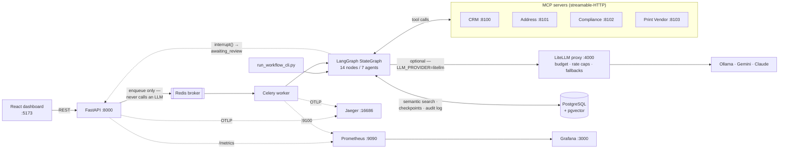

# PRF AI Pipeline

[](https://github.com/umeshkedimi/prf-ai-pipeline/actions/workflows/ci.yml)

A production-grade **agentic AI platform** for nonprofit fundraising campaigns. It takes donor records exported from a CRM and turns them into personalized, compliant, print-ready fundraising letters (PRFs) — automating donor validation, enrichment, personalization, and document generation through a multi-agent LangGraph workflow with human-in-the-loop review.

Built as a portfolio-quality reference architecture for Agentic AI / AI Platform Engineering roles: multi-agent orchestration, confidence-based routing, RAG, MCP tool integrations, checkpointing/resume, evaluation-driven development, and full explainability/auditability.

**In one sentence:** `POST /workflow/run {"donor_id": "d-0009"}` → seven agents verify the donor, repair a stale address, compute a defensible ask amount, draft a grounded letter, review it for legal risk, and hand a print-ready PDF to a mail vendor — pausing for a human whenever a deterministic rule says the decision is too consequential to automate.

---

## Contents

- [Business context](#business-context)
- [Architecture](#architecture)
- [Repository layout](#repository-layout)
- [Status](#status)
- [The pipeline graph](#the-pipeline-graph)
- [The agents](#the-agents)
- [Human review](#human-review)
- [Status and confidence semantics](#status-and-confidence-semantics)
- [Data model](#data-model)
- [API reference](#api-reference)
- [Authentication and authorization](#authentication-and-authorization)
- [CSV donor ingestion](#csv-donor-ingestion)
- [Configuration reference](#configuration-reference)
- [Getting started](#getting-started)
- [Frontend (review dashboard)](#frontend-review-dashboard)
- [Running on Kubernetes](#running-on-kubernetes)
- [Observability](#observability)
- [LLM routing and cost control](#llm-routing-and-cost-control)
- [Demos](#demos)
- [The seed dataset](#the-seed-dataset)
- [Tests and CI](#tests-and-ci)
- [Evaluation framework](#evaluation-framework)
- [Design decisions and trade-offs](#design-decisions-and-trade-offs)
- [Known limitations](#known-limitations)

---

## Business context

Nonprofits (animal rescue orgs, food banks, disaster relief, community welfare NGOs) run fundraising campaigns by mailing physical donation-request letters to previous donors. Input is donor data exported from a CRM; output is a print-ready PDF mailed by a print vendor.

```json
{
  "donor_id": "12345",
  "name": "John Doe",
  "address": "123 Main Street, Dallas, TX",
  "last_donation_amount": 100,
  "last_donation_date": "2025-04-01",
  "campaign": "Animal Rescue Mission"
}
```

Doing this by hand is slow and error-prone in ways that carry real consequence: mailing someone who asked not to be contacted, mailing a deceased donor's household, asking a $25/year donor for $5,000, mailing into a state the org isn't registered to solicit in, or printing a letter that promises an outcome a single gift can't deliver. Each of those is a distinct failure mode, and each maps to an agent below.

## Architecture


```mermaid
flowchart LR
  UI["React dashboard<br/>:5173"] -->|REST| API["FastAPI :8000"]
  CLI["run_workflow_cli.py"] --> GRAPH["LangGraph StateGraph<br/>14 nodes / 7 agents"]

  API -->|"enqueue only —<br/>never calls an LLM"| Q[["Redis broker"]]
  Q --> W["Celery worker"]
  W --> GRAPH

  subgraph MCP["MCP servers (streamable-HTTP)"]
    CRM["CRM :8100"]
    ADDR["Address :8101"]
    COMP["Compliance :8102"]
    PV["Print Vendor :8103"]
  end

  GRAPH <-->|"tool calls"| MCP
  GRAPH -->|"optional —<br/>LLM_PROVIDER=litellm"| LLM["LiteLLM proxy :4000<br/>budget · rate caps · fallbacks"]
  LLM --> VENDOR["Ollama · Gemini · Claude"]
  GRAPH <-->|"semantic search ·<br/>checkpoints · audit log"| PG[("PostgreSQL<br/>+ pgvector")]
  GRAPH -.->|"interrupt() →<br/>awaiting_review"| API

  API -.->|OTLP| J["Jaeger :16686"]
  W -.->|OTLP| J
  API -.->|"/metrics"| PROM["Prometheus :9090"]
  W -.->|":9100"| PROM
  PROM --> G["Grafana :3000"]
```

Seven LangGraph agents, each producing a confidence-scored, explainable decision, with human review interrupts for low-confidence or high-stakes cases:

| # | Agent | Responsibility | LLM? |
|---|---|---|---|
| 1 | **Donor Verification** | Eligibility, duplicate detection, do-not-contact/suppression checks | Yes (+ tool loop) |
| 2 | **Address Intelligence** | Validation, move detection, normalization | Yes |
| 3 | **Donation Recommendation** | RFM scoring, ask-ladder generation | Yes (money math is not) |
| 4 | **Campaign Personalization** | RAG-backed personalized letter copy | Yes |
| 5 | **Compliance** | Disclaimers, tax language, state regulations | Yes (registration check is not) |
| 6 | **PDF Generation** | Print-ready PDF, barcodes, QR codes, mailing metadata | **No** — purely mechanical |
| 7 | **Human Review** | LangGraph `interrupt()`-based pause/approve/reject/modify/resume | No |

### The three architectural boundaries

These are the load-bearing decisions. Everything else follows from them.

**1. The determinism boundary.** Deterministic work (MCP calls, compliance flags, RFM scoring, ask-ladder arithmetic) is done in plain Python; only genuine judgment is delegated to the LLM. **Money amounts are computed, never generated.** Critically, every *blocking* human-review gate routes off a deterministic value — the ask amount, the state-registration flag — never off a model-produced confidence float. Routing a blocking pause off a non-deterministic float would let the same donor take different paths on identical data, which is unacceptable when the output is a physical letter.

**2. The data boundary.** Structured donor/CRM/donation data lives in PostgreSQL and is queried relationally. RAG (vector search) is used *only* for unstructured campaign knowledge — annual reports, impact stats, success stories, compliance guidelines. **Donor PII is never embedded.** Semantic similarity is the wrong retrieval mechanism for "what did this donor give last year," and embedding PII into a vector store creates an exfiltration surface with no upside.

**3. The execution boundary.** The API never invokes an LLM — it validates, persists, and enqueues, then returns `202`. All model work happens in the Celery worker. This keeps request latency bounded and independent of model latency (a full run is ~30s), and means a model outage degrades throughput rather than taking down the API.

**MCP servers.** CRM, Address, Compliance, and Print Vendor are each a *real* MCP protocol server (FastMCP, streamable-HTTP), backed by synthetic/mocked data. The protocol is genuine — agents reach external systems only through auditable, tool-mediated calls via `langchain-mcp-adapters`; only the data behind them is fake. Swapping a mock for a real vendor is a URL change, not a refactor.

**Stack:** FastAPI, LangGraph, PostgreSQL (+ pgvector), Redis, Celery, Docker, OpenTelemetry, Prometheus, Grafana, Jaeger, React.

## Repository layout

```
.
├── backend/
│   ├── src/app/
│   │   ├── agents/<name>/      agent.py (graph nodes) + prompts.py + schemas.py
│   │   │                       └── plus rules.py / rfm.py / render.py where the
│   │   │                           agent has deterministic logic to keep out of the LLM
│   │   ├── graph/              builder.py (StateGraph + routing), state.py,
│   │   │                       checkpointer.py, tracing.py
│   │   ├── mcp_servers/        real FastMCP streamable-HTTP servers
│   │   │                       (crm, address, compliance, print_vendor)
│   │   ├── mcp_clients/        MultiServerMCPClient wrappers + response parsing
│   │   ├── rag/                pgvector retrieval — embeddings, store, retriever
│   │   ├── evals/              harness (types, runner, scorers, report, store)
│   │   │                       + suites/ (8 suites)
│   │   ├── workers/            Celery app + tasks + Prometheus metrics
│   │   ├── donors/             CSV ingestion (parse, validate, upsert) — Phase 9b
│   │   ├── api/v1/endpoints/   FastAPI routes (auth, donors, workflow, health)
│   │   ├── db/models/          SQLAlchemy models
│   │   ├── schemas/            Pydantic request/response schemas
│   │   └── core/               config, llm factory, audit, logging, telemetry, security
│   ├── knowledge/              markdown corpus ingested into pgvector (6 docs)
│   ├── alembic/versions/       8 migrations
│   ├── scripts/                seed_db, seed_users, ingest_knowledge, run_evals, run_workflow_cli
│   ├── evals/results/          baseline.json (committed), latest.json (gitignored)
│   ├── storage/letters/        generated PDFs (gitignored)
│   └── tests/                  unit/ (offline, mocked) + integration/ (live stack)
├── frontend/                   Vite + React + TypeScript review dashboard
├── observability/              Prometheus config + Grafana provisioning/dashboard
├── litellm/                    proxy config — model aliases, budget + rpm caps
├── k8s/                        Kustomize base + overlays/kind
├── .github/workflows/ci.yml    ruff check + offline unit suite
└── docker-compose.yml          12 services
```

Every agent directory follows the same shape, so a reviewer who reads one can navigate all seven. Where an agent has deterministic logic, it lives in its own module (`rfm.py`, `rules.py`, `render.py`) rather than inside `agent.py` — that separation is the determinism boundary made visible in the file tree.

## Status

Built **incrementally, phase by phase**, each phase fully working and demoable before the next begins.

| Phase | Scope |
|---|---|
| **1** ✅ | Repo foundations, DB schema, Donor Verification agent end-to-end (real Postgres, real CRM MCP server, real LLM call, LangGraph checkpointing, Celery + FastAPI wiring) |
| **2** ✅ | Address Intelligence agent + Address MCP + first real `interrupt()`-based Human Review node + confidence routing, chained after Donor Verification |
| **3** ✅ | Donation Recommendation agent (deterministic RFM + ask ladder) + pgvector RAG over campaign knowledge + a second review trigger on major-gift asks |
| **4** ✅ | Campaign Personalization agent (deterministic tone lookup + RAG-grounded letter draft), chained after Donation Recommendation |
| **5** ✅ | Compliance agent (deterministic state-registration/disclosure lookup + RAG-grounded letter-risk review) + Compliance MCP; a third review trigger on unregistered-state solicitation |
| **6** ✅ | PDF Generation agent (deterministic letter layout, QR code, Code128 barcode) + Print Vendor MCP — no LLM call, purely mechanical assembly and a mocked vendor order |
| **7** ✅ | Review queue (`GET /workflow/reviews` with donor/campaign names and pagination) + per-run decision history (`review_history`, derived from the audit trail) + routing a disapproved compliance review to `needs_review` + `graph/builder.py` split into named verification/fulfillment units |
| **8** ✅ | **8a** React review dashboard (`frontend/`). **8b** OpenTelemetry tracing + Prometheus metrics + Jaeger/Grafana (`observability/`) — one trace per run spanning API, Celery, and every agent node. **8c** CI (`.github/workflows/ci.yml`) — lint + offline unit suite on every push/PR |
| **9** ✅ | **9a** Auth — JWT login, `admin`/`reviewer` roles, every `/workflow` route requires a session, human-review decisions attributed to the real logged-in user instead of a client-supplied string. **9b** CSV donor ingestion (`POST /donors/ingest`, admin-only, upserts by `external_id`) staged — never auto-runs — plus `GET /donors/unrun` and `POST /workflow/run/batch` to explicitly trigger runs on staged donors |

**Evaluation framework** ✅ — built early, at three agents rather than seven, deliberately: evals written after the fact get written to pass, encoding existing behavior as correct. See [Evaluation framework](#evaluation-framework).

All nine phases plus the evaluation framework are complete — see [Authentication and authorization](#authentication-and-authorization) and [CSV donor ingestion](#csv-donor-ingestion).

## The pipeline graph

14 nodes across 7 agents (Donor Verification 3, Address Intelligence 2, Donation Recommendation 2, Campaign Personalization 2, Compliance 2, PDF Generation 1, Human Review 2). Every node is a real checkpoint boundary — the graph can crash and resume at any of them.

```
START → fetch_core_data → gather_context → synthesize_verdict
           │
           ├─ ineligible → END
           │
           └─ eligible → verify_address → assess_and_normalize
                            │
                            ├─ confidence < threshold → human_review [interrupt, stage=address]
                            ├─ deliverable → compute_rfm
                            └─ confident but undeliverable → END   (nothing to mail)
                                            │
        (address review resumes) ───────────┤
                            ├─ now deliverable → compute_rfm
                            └─ rejected → END
                                            │
                     compute_rfm → recommend_ask   [RAG over campaign knowledge]
                                       │
                                       ├─ ask ≥ major-gift threshold
                                       │      → human_review [interrupt, stage=recommendation]
                                       │            ├─ approved/modified, ask > 0 → personalize_letter
                                       │            └─ rejected (ask zeroed) → END
                                       └─ else → personalize_letter   [RAG over campaign knowledge]
                                                       │
                                     personalize_letter → gather_disclosures
                                                       │
                                                       ├─ not registered to solicit in-state
                                                       │      → human_review [interrupt, stage=compliance]
                                                       │            ├─ approve/modify → review_letter_compliance
                                                       │            └─ reject → END
                                                       └─ registered → review_letter_compliance
                                                                          [RAG over compliance guidance]
                                                                          │
                                                                          ├─ disapproved, revisions < cap
                                                                          │      → revise_letter → review_letter_compliance
                                                                          └─ approved, or cap reached
                                                                                 → generate_pdf → END
                                                                                [Print Vendor MCP]
```

In `graph/builder.py` these are assembled as two named units onto one flat `StateGraph` — a **verification unit** (`fetch_core_data` → `gather_context` → `synthesize_verdict` → `verify_address` → `assess_and_normalize`) and a **fulfillment unit** (`compute_rfm` → `recommend_ask` → `personalize_letter` → `gather_disclosures` → `review_letter_compliance` → `generate_pdf`), wired through the shared `human_review` gate.

This is deliberately a *code-organization* split, not LangGraph nested subgraphs. Nested subgraphs can only be entered at their own `START`, but `route_after_human_review` resumes **mid-unit** — into `compute_rfm`, `personalize_letter`, or `review_letter_compliance` depending on which stage paused. Nested subgraphs cannot express that, so using them would have meant contorting resume semantics to fit a diagram. A supervisor/dynamic-routing rewrite was also considered and rejected: it would spread runtime-decided routing across the whole pipeline shape, cutting directly against the determinism boundary.

## The agents

**Donor Verification** (Phase 1) — 3 nodes:

1. **`fetch_core_data`** — deterministic `get_donor_profile` MCP call. `do_not_contact`/suppression flags are read as-is, never inferred by the LLM.
2. **`gather_context`** — an LLM bound to `get_donation_history` + `find_potential_duplicate_donors` (via `langchain-mcp-adapters`, a real streamable-HTTP MCP server), in a bounded tool-calling loop.
3. **`synthesize_verdict`** — structured-output LLM call (`eligible`, `confidence`, `reason`, `is_duplicate`, `is_suspicious`, `reasoning[]`). The prompt tells the model do-not-contact and suppressed donors are ineligible, but that is **not** left to the prompt: `enforce_eligibility` (`agents/donor_verification/eligibility.py`) forces `eligible` to `False` in code whenever the CRM flag is set, and records the model's pre-correction verdict in the audit trail when it had to. It is one-directional — it can only remove eligibility, never grant it — and leaves confidence untouched. (This was previously only prompted, while the routing docstring described it as enforced; the same instructed-not-enforced gap the ask-ladder guard closed.) "Eligible" is scoped strictly to compliance/legitimacy — the model is explicitly told *not* to factor in address deliverability, which is a separate downstream concern.

**Address Intelligence** (Phase 2) — 2 nodes, only reached if the donor is eligible:

1. **`verify_address`** — deterministic `verify_address` MCP call. Donors with no address on file skip the call entirely.
2. **`assess_and_normalize`** — deterministically calls `lookup_new_address` when `verify_address` flagged `moved=true` (that lookup is a business rule, not a judgment call), then an LLM produces the final structured `AddressResult` (`deliverable`, `confidence`, `updated_address`, `moved`, `reasoning[]`).

**Donation Recommendation** (Phase 3) — 2 nodes, only reached for a donor we can actually mail:

1. **`compute_rfm`** — fully deterministic. Recency/Frequency/Monetary scoring and the 3-rung ask ladder (typical → step-up → aspirational) are computed by formula from giving history, with no LLM involved. Reuses the `donation_history` `gather_context` already fetched rather than re-hitting the CRM.
2. **`recommend_ask`** — retrieves campaign knowledge from pgvector, then an LLM *chooses* a rung from that ladder and justifies it. It is explicitly forbidden from inventing or altering dollar figures — the money math is reproducible and auditable; only the judgment is model-driven.

The ladder is **outlier-robust**: if the top gift dwarfs the rest of the history (>5× the median), it's treated as a likely data-entry error or one-off windfall and the anchor falls back to the median, recorded as `outlier_gift_excluded`. Without this, d-0006's anomalous $50,000 donation — the very record Donor Verification flags as suspicious — would have produced a $125,000 ask.

**RAG** (Phase 3) — semantic search over *unstructured campaign knowledge* only (impact stats, program outcomes, success stories, ask-strategy and stewardship guidelines) in `backend/knowledge/`, chunked by heading, embedded with OpenAI `text-embedding-3-small` and stored in a pgvector `knowledge_chunks` table with an HNSW cosine index. **Donor PII is never embedded** — structured donor data stays in the relational tables. Embeddings are provider-agnostic via LangChain `init_embeddings`, mirroring how `get_llm()` handles chat models. Re-ingest is idempotent (delete-and-reinsert per document).

**Campaign Personalization** (Phase 4) — 2 nodes (`personalize_letter`, plus `revise_letter` for the bounded compliance rewrite loop), reached once an ask survives the recommendation stage:

1. **`personalize_letter`** — a deterministic tone lookup keyed on the donor's RFM segment (gentle/reconnecting for lapsed, an invitation to step up for loyal, personal/relationship-based for major — the same segment vocabulary `recommend_ask` uses), then an LLM drafts the appeal letter within that fixed tone, grounded in retrieved stewardship and impact knowledge. The model never chooses the tone and never invents a cited figure; it only drafts. A rejected recommendation (ask zeroed by `human_review`) skips this node entirely — there's nothing to personalize for a $0 letter.

**Compliance** (Phase 5) — 2 nodes, reached once a letter has been drafted:

1. **`gather_disclosures`** — deterministic `get_disclosure_requirements` MCP call keyed on the donor's state. Whether the org is registered to solicit there at all is a legal fact, not a judgment call — if not, there is no letter-content review to make, so the graph pauses immediately rather than spending an LLM call on wording for a letter that can't legally mail regardless.
2. **`review_letter_compliance`** — only reached when registered. Retrieves compliance guidance from pgvector and has an LLM judge the drafted letter for donor-rights/tax-language risk (`approved`, `confidence`, `flagged_issues[]`, `reasoning[]`). Required disclosures are merged in afterward from `gather_disclosures`' output, **never routed through the LLM** — legal boilerplate is not something a model should be asked to reproduce. `approved: false` routes the run to `needs_review` and, once the revise loop is exhausted, **holds the letter back from the print vendor** (see `generate_pdf`).

   **Critique → revise loop.** Before falling through, a disapproved letter is sent to `revise_letter` (in `campaign_personalization`), which redrafts with the previous draft and the reviewer's `flagged_issues` in the prompt, then goes back to `review_letter_compliance` (not `gather_disclosures` — disclosures depend only on the donor's state). Capped at `MAX_LETTER_REVISIONS` (default 2) by a plain counter, `letter_revisions`, so the loop is bounded by code, never by the model deciding it is done. This routes off the model's `approved` boolean, which the determinism boundary normally avoids; it is acceptable here because the loop is advisory and bounded — a misjudgement costs one extra or one skipped draft — while the blocking compliance gate (state registration) still never reads model output. Each rewrite writes its own `revise_letter` audit row including the feedback it received. The trajectory eval strips rewrite cycles from the recorded path (`collapse_revisions`): whether a draft needed rewriting is model judgment, and scoring it would make `node_path_exact` grade drafting quality instead of routing.

**PDF Generation** (Phase 6) — 1 node, the pipeline's terminus:

1. **`generate_pdf`** — fully deterministic, **no LLM call at all**: every judgment the letter needed (copy, risk review) already happened upstream, so what's left is mechanical layout and a vendor order. Renders a print-ready single-page PDF (`reportlab`) styled as a real appeal letter — a letterhead (org name, tagline, contact line, accent-color rule), the dated recipient block, the drafted salutation/body/closing, a highlighted "your gift today" callout box built from the deterministic `recommended_ask` (never the letter's own prose — same non-LLM-boilerplate reasoning as the disclosures), a signature block, a P.S. line, the required disclosures, a QR code encoding a donation-tracking URL, and a Code128 barcode encoding a deterministic mail-piece reference (`sha256(workflow_run_id)[:8]` — stable across re-renders, distinct per run, so eval assertions can predict it). Body text wraps by actual glyph width (`pdfmetrics.stringWidth`), not a fixed character count, since the letter fonts are proportional. **The vendor order is the pipeline's one irreversible side effect, so it is gated on Compliance:** a letter still disapproved after the revise loop is rendered (a reviewer can read it via `GET /workflow/{id}/pdf`) but no order is submitted — `pdf_result` carries `held: true`, a `hold_reason` taken from the flagged issues, and null order fields. Only an explicit `approved: false` holds; a missing verdict does not. A human can then release or discard a held letter (see *Releasing a held letter* under Human review). Otherwise it submits the reference to the mocked Print Vendor MCP server and merges its order confirmation (`vendor_order_id`, `tracking_number`, `postage_class`, `turnaround_days`, `cost`) into `pdf_result`. The org identity in the letterhead (address, phone, signer name) is invented, synthetic detail, the same fictional-but-consistent convention as the rest of the seed data.

## Human review

The platform's genuine pause: a real LangGraph `interrupt()`, not a status flag. One node serves **three review stages**, discriminated by checking most-downstream-first (each later stage's result key only exists once the one before it is resolved, so ordering makes this reliable):

| Stage | Trigger | Deterministic? | On resume |
|---|---|---|---|
| **address** | Address confidence below threshold (0.80) | No — model confidence | Continues to recommendation if now deliverable; stops if rejected |
| **recommendation** | Ask ≥ `MAJOR_GIFT_ASK_THRESHOLD` ($1,000) | **Yes** — a dollar amount | Continues to personalization if the (possibly human-adjusted) ask is still positive; stops if rejected |
| **compliance** | Org not registered to solicit in donor's state | **Yes** — a legal flag | Continues into letter-content review then PDF if approve/modify; ends the run if rejected |

The workflow genuinely cannot proceed until a decision (`approve`/`reject`/`modify`) arrives via `POST /workflow/{id}/review`. The decision — action, reviewer, notes — is always recorded for the audit trail regardless of outcome.

**`reconcile_decision` — reasoning after the decision.** Between `human_review` and the resume routing, one node reads the reviewer's free-text `notes` and extracts *writing guidance* for the letter (e.g. "donor recently lost her husband — keep it gentle"), which `personalize_letter` and `revise_letter` receive as a lower-priority prompt section. Boundaries, each deliberate:

- **It cannot route.** `route_after_human_review` still reads only the deterministic decision and state. An early design had the model choose a re-entry node; reading the code showed there is no legitimate alternative — re-running `compute_rfm` would overwrite a human-adjusted ask, and re-verifying a corrected address needs a structured address, not the free-text one the reviewer typed — so that choice would have been theater.
- **It cannot touch the ask, tone label or disclosures.** The prompt forbids it, and none of those fields are writable from its output.
- **Human-influenced text is still reviewed.** The drafted letter goes through Compliance and the revise loop like any other draft.
- **It spends no LLM call when there's nothing to interpret.** Skipped deterministically on reject, at the compliance stage (drafting is already done), and on empty notes. Guidance from an earlier pause is kept when a later pause adds more.
- **Audited under its own agent name** (`decision_reconciliation`), not `human_review` — `review_history` is built from `human_review` rows, and a reconciliation is not a human decision.
- **Guidance is advisory, not guaranteed.** A live d-0011 run with "keep it gentle, don't pressure" produced a letter that acknowledged long-standing loyalty but still said "step up this commitment" — the model follows guidance imperfectly, and the ask itself is fixed by the ladder. Reviewers who need a different amount use `modify`.

### Concurrent reviewers, and a paused run that goes stale

**Two reviewers on the same pause.** `POST /review` claims the run with one conditional `UPDATE` (`awaiting_review` → `running`) that also requires the decision's `stage` to equal the stage the run is paused at, so exactly one reviewer wins and the other gets `409`. This was a real bug, not a theoretical one: with no claim, both decisions were enqueued, and the second resume was consumed by whichever interrupt the graph reached *next* — checked directly against LangGraph, a reject meant for the address stage was applied to the recommendation stage; if no further pause existed it was silently dropped, with a `202` and a clean audit trail. `stage` is required precisely because the request used to carry nothing tying a decision to the pause it was made for. If the broker is down the claim is handed back (`503`) rather than stranding the run in `running`.

**Data that changes while a run is paused.** `donor_profile` is a snapshot from before the pause, and a run can wait days. Re-reading everything on resume would make a reviewer's decision about data they never saw, so only the two *hard* eligibility facts are re-read: after any non-reject decision `human_review` re-fetches the donor's `do_not_contact` / `is_suppressed` flags, and a donor who opted out or was suppressed in the meantime ends the run (`completed`, nothing mailed, `verification_result.revoked_during_review`) whatever the reviewer decided. The recheck is recorded in the audit row. A reject skips it — it ends the run anyway, and a CRM outage shouldn't be able to block a reject; for the others a failed lookup fails the run loudly, the same as any other CRM call, rather than silently skipping the check.

Deliberately not handled: other snapshotted data (address, state registration) is not refreshed; routing thresholds read at resume time, so a config change during a pause applies from the next routing decision; and a paused run resumes on the *new* code after a deploy — adding a node is safe (that is how `reconcile_decision` shipped), renaming or removing one a paused run depends on is not, and there is no pause expiry.

### Stalled runs

A run's status becomes `running` when a Celery task starts it, and only that task moves it on. If the worker is killed mid-graph the message was already acknowledged, so the broker never redelivers it and the run reads `running` forever — reproduced by killing the worker container six nodes into a d-0001 run. The work is not lost: the graph checkpoints after every node, so recovery is *detect* and *continue from the checkpoint*.

- **Detect.** Every node stamps `workflow_runs.heartbeat_at` as it starts (`traced_node`), so the TTL (`RUN_STALL_TTL_SECONDS`, 600) only has to exceed the slowest *single node*, not a whole run. Only `running` runs with no `result` yet qualify; a held-letter release also sits in `running` but has its own recovery.
- **Claim, then continue.** Takeover is a compare-and-swap with the staleness test inside the `UPDATE`'s `WHERE`, so two recoverers can't both resume one run. The recovered task calls the graph with no input, which continues from the last checkpoint; if the worker died before the first checkpoint existed it starts fresh instead.
- **When it runs.** On worker start, and again once the TTL has elapsed. The second sweep is the one that matters: a worker that crashes and restarts quickly leaves a heartbeat that is still *fresh* at startup, so an immediate sweep correctly ignores it — it can't tell dead from slow. Verified live: a run killed after six nodes resumed from `recommend_ask` (no repeated nodes) roughly TTL after the worker came back, and completed with a real order.
- **Why re-running the interrupted node is safe.** Reads repeat harmlessly, the PDF render overwrites the same file, the vendor order is keyed on the run's deterministic reference, and a node's output only reaches state when it completes. The cost is a repeated LLM call and a duplicate audit row.

Not covered: no periodic sweeper (a worker that dies and is never restarted waits for the next start — a Celery beat process would close that); runs from before the heartbeat column existed have none and are never recovered; a run that is merely very slow *past the TTL* on one node could be resumed while the original is still alive (the TTL is the guard, and it is generous); and a run stuck in `pending` because its message was lost is not detected.

### Releasing a held letter

A letter Compliance still disapproves after the revise loop is rendered but never ordered (`pdf_result.held`), leaving the run in `needs_review`. `POST /workflow/{id}/release` lets a human decide it: **release** places the print order and completes the run; **discard** closes it as `discarded` and nothing is ever mailed. A reason is required either way, and the reviewer identity comes from the session, not the body.

Why a separate endpoint rather than `/review`: `/review` resumes a graph paused on an `interrupt()`. This run already reached `END` — there is nothing to resume, only one irreversible side effect to allow or forbid — so a different resource action with different semantics (and a different error contract) is the honest shape.

What makes it safe to expose:

- **Atomic claim.** The endpoint takes the run with a single conditional `UPDATE ... WHERE status='needs_review' AND held` — two simultaneous releases cannot both win; the loser gets `409` and no second order is placed. Verified live with two concurrent requests: one `202`, one `409`, exactly one vendor call.
- **Failure is recoverable.** If the broker is down the claim is rolled back (`503`); if the vendor call fails the task returns the run to `needs_review`, still held, with the error recorded. A run is never stranded in `running` by a handled failure.
- **One place places orders.** `generate_pdf` and the release task share `submit_print_order`, and the order is keyed on the deterministic reference.
- **The override is on the record.** Recorded in `review_history` as a `release`/`discard` decision with reviewer and reason. The Compliance verdict itself is left as `approved: false` — a human overruling it doesn't rewrite it, matching the rule that approval never inflates a recorded result.

**Stuck-claim recovery.** Releasing is two steps that can't be one transaction — claim the run, then place the order in a Celery task — so a process can die between them or mid-task, leaving a run in `running` that nothing will advance. An idempotency key alone doesn't fix that: it makes a retry *safe* (here the order is keyed on the run's deterministic reference, so a repeat can't double-order) but nothing *performs* the retry. So recovery has both halves:

- **Detect.** Each claim stamps `release_claim` (when, who, why) into `pdf_result`; a claim older than `RELEASE_CLAIM_TTL_SECONDS` (300) is stale. Takeover is a compare-and-swap with the staleness test inside the `UPDATE`'s `WHERE`, so a claim refreshed or completed between read and write is refused rather than duplicated.
- **Retry, automatically and manually.** A restarted worker sends `recover_stale_releases` on `worker_ready` — immediately, and again once the TTL has elapsed (a worker that crashes and restarts quickly leaves a claim that is still *fresh* at startup, so only the delayed sweep can call it stalled) — which re-enqueues each stale claim with its *original* reviewer and notes. A reviewer can also call `POST /release` again on a run stalled past the TTL (the dashboard offers a Retry button); a fresh claim still gets `409`.
- **The release task is idempotent**: if the run is no longer a held, claimed release it does nothing, so a duplicate or redelivered task cannot order twice.

Verified live: planted two stale claims, recovered one by restarting the worker (completed under the original reviewer's name) and the other through the endpoint; both ended `completed` with an order.

Not covered, deliberately: recovery runs at worker start (twice, see above) and on demand, not on a timer (a periodic sweeper needs a Celery beat process — new infrastructure in compose and k8s — so a worker that dies *and is never restarted* waits for a manual retry); a claim made before this mechanism existed has no stamp and is not recovered; both roles may release (no policy distinguishes them yet); and the mock vendor is idempotent by construction where a real one would need an idempotency key.